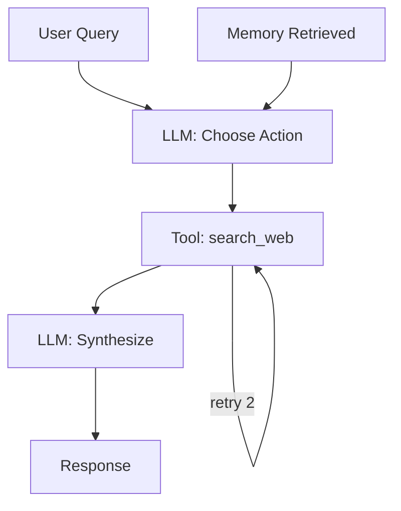

# Decision Graph UI

Agents are graph-shaped systems. The UI should match the topology.

## What the graph reveals

- Causal influence of memory and tools
- Retry loops and latency roots
- Runtime termination causes

<Callout type="info">
Decision graphs are more than visualization. They are the spine of replay and root-cause analysis.
</Callout>
