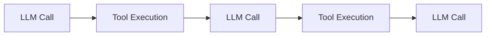

# Decision Loop Reconstruction

WhyOps infers step boundaries from observed boundary events.

## Why inference works

- Most agent frameworks follow a think → act → observe loop.
- Boundary events appear in consistent order.
- The sequence is sufficient to build a decision graph.

## Where SDK improves accuracy

- Planner internal state
- Hidden retries
- Memory retrieval filters

<Callout type="tip">
Inference provides scale. SDK provides precision.
</Callout>
