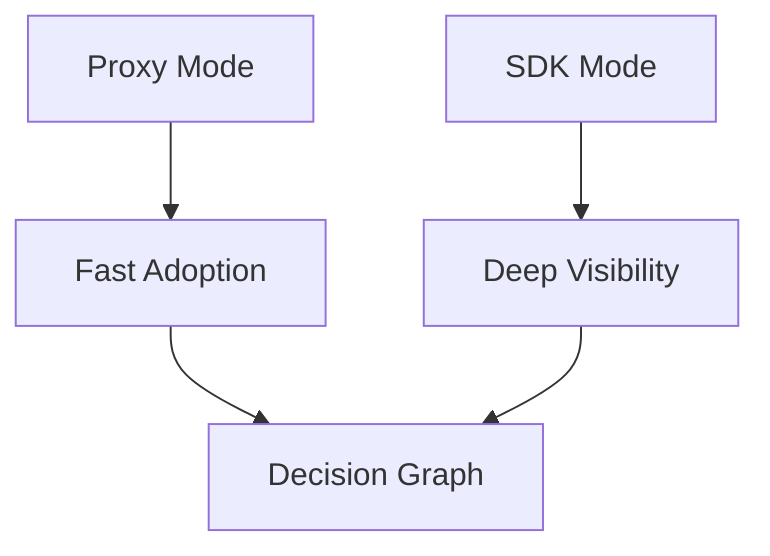

# Integration Modes

WhyOps is designed with two adoption paths.

<Tabs>
  <Tab title="Proxy Mode">
    <ul>
      <li>Minimal integration (URL change or env var)</li>
      <li>Captures LLM-visible cognition</li>
      <li>Reconstructs loops by inference</li>
      <li>Fast adoption and low friction</li>
    </ul>
  </Tab>
  <Tab title="SDK Mode">
    <ul>
      <li>Decorators around tools and memory retrieval</li>
      <li>Captures runtime cognition</li>
      <li>Retry, planner state, and memory influence visibility</li>
      <li>Deep accuracy for power users</li>
    </ul>
  </Tab>
</Tabs>

<Callout type="warning">
Both modes are conceptual. There is no SDK or proxy available yet.
</Callout>
