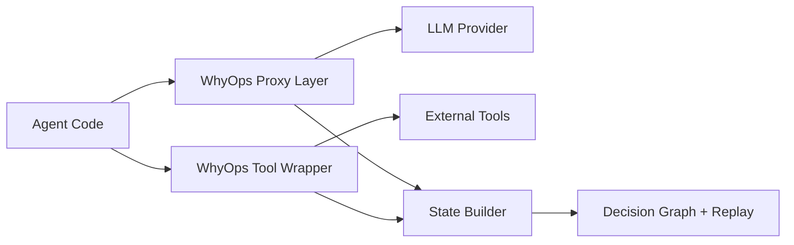

# Architecture Overview

WhyOps reconstructs cognition by capturing decision boundaries and stitching them into a causal graph.

## The three capture layers

<CardGroup cols={3}>
  <Card title="LLM Proxy" icon="network-wired">
    Prompts, tools, responses, latency, token usage.
  </Card>
  <Card title="Tool Wrapper" icon="plug">
    Actual tool I/O, retries, errors, and latency.
  </Card>
  <Card title="State Builder" icon="project-diagram">
    Reconstructs step boundaries and causal graph.
  </Card>
</CardGroup>

## Why this works

- Every framework ultimately calls functions.
- Decision boundaries are stable across toolchains.
- Causal links between memory → LLM → tool → LLM explain behavior.
