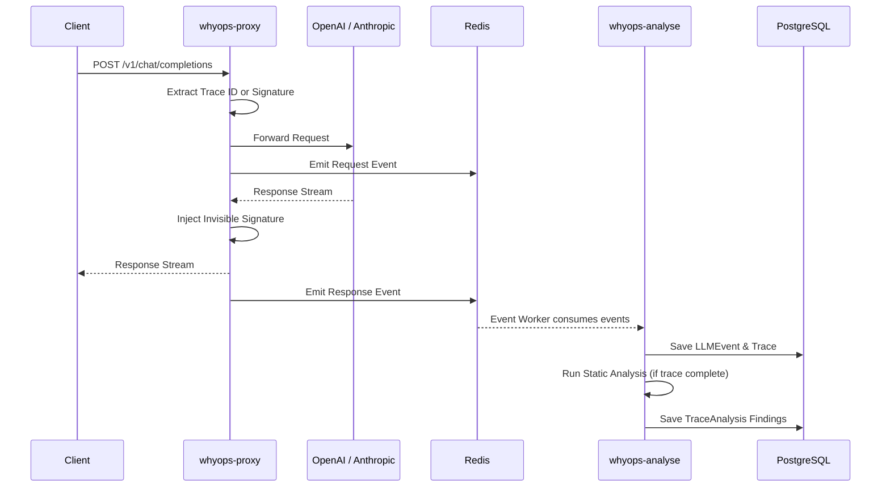

WhyOps is composed of four primary components that work together to provide observability and analysis for your AI agents.

## 1. Proxy Service (`whyops-proxy`)
The Proxy is the entry point for your agent's LLM requests. It sits between your application and the LLM providers (OpenAI, Anthropic). 

It is responsible for:
- Authenticating your API key.
- Resolving which provider credentials to use based on the model requested.
- Managing Trace IDs (via headers or Invisible Signatures).
- Forwarding the request to the upstream provider.
- Streaming the response back to your client while teeing a copy for analysis.
- Injecting invisible signatures into responses.
- Emitting asynchronous events to Redis.

## 2. Analyse Service (`whyops-analyse`)
The Analyse service is the core backend. It consumes the events emitted by the Proxy from Redis and persists them to the PostgreSQL database.

It is responsible for:
- Storing `LLMEvent`, `Trace`, and `Project` data.
- Running Static Analysis on completed traces to detect loops, missing tool calls, and latency outliers.
- Running LLM Judge evaluations (`AgentAnalysisRuns`) on traces based on configured dimensions.
- Providing REST APIs for the dashboard to fetch analytics, costs, and traces.

## 3. Auth Service (`whyops-auth`)
The Auth service manages user authentication and authorization using `better-auth`. 

It handles:
- User signup and login.
- Session management.
- API Key generation and validation for the Proxy and Analyse services.

## 4. Frontend App (`app`)
The frontend is a Next.js application that provides the visual interface for WhyOps.

It features:
- **Decision Graphs**: Interactive Node/Edge diagrams built with `reactflow` and `dagre` that visualize an agent's execution path.
- **Trace Analysis**: Detailed views of every step, prompt, and tool call in a trace.
- **Agent Evaluations**: Dashboards showing your agent's performance across dimensions over time, using `recharts`.
- **Project Settings**: Manage API keys, providers, and environment configurations.

## The Data Flow

```mermaid
sequenceDiagram
    participant Client
    participant Proxy as whyops-proxy
    participant Upstream as OpenAI / Anthropic
    participant Redis
    participant Analyse as whyops-analyse
    participant DB as PostgreSQL

    Client->>Proxy: POST /v1/chat/completions
    Proxy->>Proxy: Extract Trace ID or Signature
    Proxy->>Upstream: Forward Request
    Proxy->>Redis: Emit Request Event
    Upstream-->>Proxy: Response Stream
    Proxy->>Proxy: Inject Invisible Signature
    Proxy-->>Client: Response Stream
    Proxy->>Redis: Emit Response Event
    
    Redis-->>Analyse: Event Worker consumes events
    Analyse->>DB: Save LLMEvent & Trace
    Analyse->>Analyse: Run Static Analysis (if trace complete)
    Analyse->>DB: Save TraceAnalysis Findings
```
