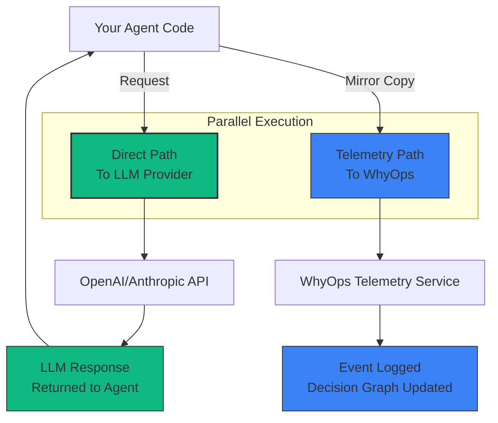

**WhyOps uses "shadow telemetry" instead of traditional inline proxying.**

The proxy layer captures **LLM cognition**—prompts, tools, responses, and usage—but does so by mirroring traffic in parallel, not intercepting it.

<Callout type="success" title="Key Difference from Traditional Proxies">
**Traditional Proxy:** Your request → Proxy → LLM → Proxy → Your app (inline)

**WhyOps Shadow Telemetry:** Your request → LLM (direct) + Mirror → WhyOps (parallel)

**Result:** Zero added latency, zero production risk
</Callout>

---

## How It Works

### Architecture Diagram



**Green Path (Critical):** Direct to LLM, no intermediary  
**Blue Path (Observability):** Async mirror to WhyOps

---

## What the Proxy Layer Captures

### LLM Boundary Events

<CardGroup cols={2}>
  <Card title="Request Data" icon="arrow-right">
    **Captured:**
    - System prompts
    - User messages
    - Tool definitions available
    - Model configuration (temperature, max_tokens)
    - Timestamp
    
    **Sent to:** WhyOps asynchronously
  </Card>
  
  <Card title="Response Data" icon="arrow-left">
    **Captured:**
    - Model-generated text
    - Tool call requests
    - Token usage (prompt + completion)
    - Latency metrics
    - Finish reason
    
    **Sent to:** WhyOps after user receives response
  </Card>
</CardGroup>

### Example: What Gets Logged

```json
{
  "event_type": "llm_call",
  "thread_id": "t_abc123",
  "step_id": 3,
  "timestamp": "2026-01-30T10:15:30.234Z",
  
  "request": {
    "provider": "openai",
    "model": "gpt-4",
    "system_prompt": "You are a helpful assistant...",
    "messages": [
      {"role": "user", "content": "What's the weather?"}
    ],
    "tools": [
      {"name": "get_weather", "description": "..."}
    ],
    "temperature": 0.7,
    "max_tokens": 500
  },
  
  "response": {
    "content": null,
    "tool_calls": [
      {"name": "get_weather", "args": {"city": "NYC"}}
    ],
    "usage": {
      "prompt_tokens": 245,
      "completion_tokens": 12,
      "total_tokens": 257
    },
    "latency_ms": 1240
  }
}
```

---

## Two Implementation Modes

<Tabs>
  <Tab title="Shadow Mode (Default)">
    ### Zero-Risk Mirroring
    
    **Setup:**
    ```javascript
    import { WhyOps } from '@whyops/sdk';
    
    const whyops = new WhyOps({ apiKey: 'your-key' });
    
    // Wrap your OpenAI client
    const openai = whyops.wrapOpenAI(new OpenAI());
    
    // All calls automatically mirrored
    const response = await openai.chat.completions.create({
      model: "gpt-4",
      messages: [...]
    });
    ```
    
    **How It Works:**
    1. Request goes directly to OpenAI
    2. WhyOps SDK mirrors request asynchronously
    3. Response comes back from OpenAI
    4. WhyOps SDK mirrors response asynchronously
    
    **Latency Impact:** 0ms (fire-and-forget mirroring)
    
    **Production Risk:** None (if WhyOps fails, only mirroring stops)
    
    **Coverage:** ~70-80% of agent cognition
  </Tab>
  
  <Tab title="Optional Proxy Mode">
    ### For Specific Use Cases
    
    **When You'd Use This:**
    - Request sampling (reduce LLM costs)
    - PII redaction before LLM
    - Dynamic model routing
    - Traffic shaping
    
    **Setup:**
    ```javascript
    const whyops = new WhyOps({
      mode: 'proxy',  // Opt-in
      proxyUrl: 'https://proxy.whyops.ai',
      failOpen: true  // Critical: falls back to direct on failure
    });
    
    // Change base URL
    const openai = new OpenAI({
      baseURL: 'https://proxy.whyops.ai/v1'
    });
    ```
    
    **How It Works:**
    1. Request routed through WhyOps proxy
    2. Proxy logs event
    3. Proxy forwards to OpenAI
    4. Response logged and returned
    
    **Latency Impact:** +10-30ms (proxy hop)
    
    **Production Risk:** Low (fail-open design falls back to direct)
    
    **Coverage:** ~70-80% (same as shadow mode)
    
    <Callout type="warning">
    Even in proxy mode, **failOpen: true** ensures that if WhyOps proxy is down, requests automatically route directly to OpenAI.
    </Callout>
  </Tab>
</Tabs>

---

## What the Proxy Layer Misses

The proxy (whether shadow or inline) only sees the **LLM API boundary**. It misses runtime cognition:

<AccordionGroup>
  <Accordion title="Internal Tool Retries" icon="rotate">
    **What Happens:**
    ```
    LLM → Call tool "search_api"
    Framework → Attempt 1: Timeout
    Framework → Attempt 2: Timeout  
    Framework → Attempt 3: Success
    Framework → Tell LLM: "Success"
    ```
    
    **Proxy Sees:**
    - LLM requested tool
    - Tool returned success (one event)
    
    **Proxy Misses:**
    - 2 failed attempts
    - Timeout errors
    - 10 seconds of hidden latency
    
    **Solution:** Use SDK tool wrappers
  </Accordion>
  
  <Accordion title="Sanitized Tool Output" icon="filter">
    **What Happens:**
    ```
    Tool returns: "<!DOCTYPE html&gt;503 Service Unavailable"
    Framework sanitizes to: "Tool execution failed"
    LLM receives: "Tool execution failed"
    ```
    
    **Proxy Sees:**
    - LLM received "Tool execution failed"
    
    **Proxy Misses:**
    - Real error was HTML 503
    - Tool returned malformed response
    - Why it actually failed
    
    **Solution:** Use SDK tool wrappers to capture raw output
  </Accordion>
  
  <Accordion title="Memory Retrieval Mechanics" icon="database">
    **What Happens:**
    ```
    1. Query rewritten from "latest policy" → "policy"
    2. 47 docs found in vector search
    3. Filtered to 4 docs (threshold 0.80)
    4. These 4 docs injected in prompt
    ```
    
    **Proxy Sees:**
    - Prompt contains 4 documents
    
    **Proxy Misses:**
    - Why "latest" keyword was dropped
    - 43 docs were filtered out
    - Best rejected doc scored 0.79 (just below threshold)
    
    **Solution:** Use SDK memory retrieval hooks
  </Accordion>
  
  <Accordion title="Planner State Changes" icon="brain">
    **What Happens:**
    ```
    Step 3: Planner confidence = 0.42 (low)
    Step 4: Planner switches from "search" strategy to "fallback"
    Step 5: Max iterations reached, force stop
    ```
    
    **Proxy Sees:**
    - Sequence of LLM calls
    - Agent stopped at step 5
    
    **Proxy Misses:**
    - Why strategy changed
    - Confidence scores
    - Why agent stopped (max iterations, not LLM decision)
    
    **Solution:** Use SDK planner state capture
  </Accordion>
</AccordionGroup>

**Coverage Summary:**

| Layer | Proxy Captures | SDK Adds |
|-------|---------------|----------|
| **LLM cognition** | ✅ Full | ✅ Full |
| **Tool execution** | ⚠️ LLM's view only | ✅ Execution reality |
| **Memory retrieval** | ⚠️ Final docs only | ✅ Full RAG pipeline |
| **Planner state** | ❌ Not visible | ✅ Strategy and confidence |
| **Framework behavior** | ❌ Not visible | ✅ Retries, overrides, termination |

---

## Production Safety: Fail-Open Design

### What Happens If WhyOps Goes Down

<Tabs>
  <Tab title="Shadow Mode">
    **Impact: NONE**
    
    Your LLM calls continue working exactly as before WhyOps:
    
    ```javascript
    // What executes if WhyOps telemetry fails:
    
    try {
      const response = await openai.chat.completions.create(...); // ✅ Works
      whyops.mirrorAsync(request, response);  // ❌ Fails silently
    } catch (whyopsError) {
      // Never thrown - telemetry errors are swallowed
    }
    
    return response; // ✅ User gets response
    ```
    
    **Result:**
    - ✅ AI continues working
    - ✅ Users see no difference
    - ❌ Decision graphs not updated (temporary)
  </Tab>
  
  <Tab title="Proxy Mode (Fail-Open)">
    **Impact: Automatic Fallback**
    
    ```javascript
    // Fail-open logic:
    
    try {
      // Try WhyOps proxy first
      const response = await fetch('https://proxy.whyops.ai/v1/chat/completions');
      return response;
    } catch (proxyError) {
      // Automatic fallback to direct
      console.warn('WhyOps proxy unavailable, using direct connection');
      const response = await fetch('https://api.openai.com/v1/chat/completions');
      return response;
    }
    ```
    
    **Result:**
    - ✅ AI continues working (via fallback)
    - ✅ Users may see slight delay (one retry)
    - ❌ Observability lost (temporary)
  </Tab>
</Tabs>

### Guaranteed by Design

<CardGroup cols={2}>
  <Card title="No Single Point of Failure" icon="shield">
    WhyOps is never the only path to your LLM. Shadow mode has zero dependency, proxy mode has automatic fallback.
  </Card>
  
  <Card title="No Added Latency (Shadow)" icon="gauge">
    Mirroring happens asynchronously after user gets response. Zero ms added to critical path.
  </Card>
  
  <Card title="Local Buffering" icon="database">
    If telemetry service is unreachable, events buffer locally and retry automatically when service recovers.
  </Card>
  
  <Card title="Silent Failure" icon="volume-xmark">
    Telemetry errors never bubble up to your application code. Your AI never crashes due to observability.
  </Card>
</CardGroup>

---

## Why This Architecture Wins Enterprise Trust

<Callout type="success" title="The Trust Equation">
**Traditional Proxy Trust Question:**  
"Can we trust routing production traffic through your startup?"

**WhyOps Shadow Telemetry Answer:**  
"You don't have to. We never touch your production traffic. We observe in parallel."

This eliminates the trust barrier entirely.
</Callout>

### What Security Teams Care About

| Concern | Traditional Proxy | WhyOps Shadow |
|---------|------------------|---------------|
| **Single point of failure?** | ✅ Yes (inline gateway) | ❌ No (parallel observer) |
| **Added latency?** | ✅ Yes (+10-50ms) | ❌ No (0ms) |
| **Vendor dependency?** | ✅ Yes (critical path) | ❌ No (observability only) |
| **Data interception possible?** | ✅ Yes (all traffic routed through) | ⚠️ Mirrored copy only |
| **Outage risk to production?** | ✅ High | ❌ None |

**Result:** Faster security approval, easier enterprise adoption

---

## Proxy vs SDK: When to Use Each

<Steps>
  <Step title="Start with Shadow Mode (Proxy Layer)">
    **Use When:**
    - Quick integration needed
    - Want to evaluate WhyOps with minimal code changes
    - LLM-level visibility is sufficient
    
    **Integration Effort:** 5 minutes (wrap OpenAI client)
    
    **Coverage:** ~70%
  </Step>
  
  <Step title="Add SDK for Tool Visibility">
    **Use When:**
    - Debugging tool execution failures
    - Need retry tracking
    - Want to see sanitization behavior
    
    **Integration Effort:** 30 minutes (decorate tools)
    
    **Coverage:** ~85%
  </Step>
  
  <Step title="Add SDK for Memory Visibility">
    **Use When:**
    - Debugging RAG retrieval issues
    - Need to understand memory influence
    - Optimizing retrieval thresholds
    
    **Integration Effort:** 30 minutes (wrap retrieval)
    
    **Coverage:** ~93%
  </Step>
  
  <Step title="Add SDK for Planner Visibility">
    **Use When:**
    - Need complete cognitive transparency
    - Debugging complex multi-step failures
    - Building compliance audit trails
    
    **Integration Effort:** 1-2 hours (planner hooks)
    
    **Coverage:** ~95%
  </Step>
</Steps>

<Callout type="tip">
**Recommendation:** Start with shadow mode to prove value, then progressively add SDK instrumentation where debugging is needed most.

This progressive approach minimizes integration effort while maximizing ROI.
</Callout>

---

## Next Steps

<CardGroup cols={2}>
  <Card title="Shadow Telemetry Deep Dive" icon="ghost" href="/architecture/shadow-telemetry">
    Complete guide to the non-blocking architecture
  </Card>
  
  <Card title="SDK Layer" icon="code" href="/architecture/sdk-layer">
    How to instrument tools, memory, and planner for full visibility
  </Card>
  
  <Card title="Integration Modes" icon="plug" href="/architecture/integration-modes">
    Compare proxy vs SDK approaches and choose your deployment
  </Card>
  
  <Card title="Performance &amp; Privacy" icon="shield" href="/implementation/performance-privacy">
    Benchmarks and data handling policies
  </Card>
</CardGroup>

