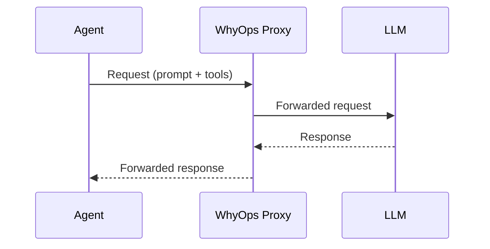

# Proxy Layer

The proxy captures **LLM cognition**: prompts, tools, responses, and usage.

## Captures

- System and user prompts
- Tool definitions and tool call requests
- Model responses
- Token usage and latency

## What the proxy misses

- Internal tool retries
- Sanitized tool output
- Memory mutations and retrieval filtering
- Planner state and termination rules

<Callout type="info">
Proxy is the adoption engine. SDK is the truth engine.
</Callout>
