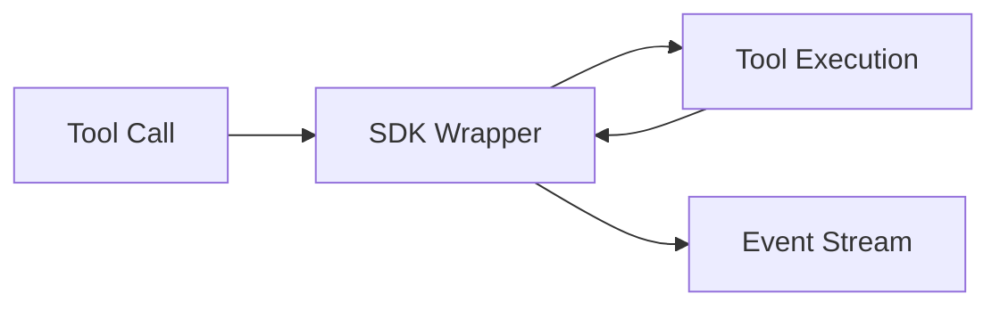

The SDK wraps decision boundaries to expose runtime cognition.

## What it captures beyond the proxy

- Tool retries and failure loops
- Actual tool output vs LLM-received output
- Planner state per iteration
- Memory retrieval candidates, scores, and filters

<Callout type="warning">
SDK instrumentation is planned but not available yet.
</Callout>
