**WhyOps runs alongside your AI, never in front of it.**

This is the fundamental architectural decision that makes WhyOps production-safe: we observe your agent traffic in parallel, never inline. If WhyOps goes down, your AI keeps running.

<Callout type="success" title="The Core Guarantee">
**WhyOps can never take your AI down. We designed it that way.**

Your LLM requests go directly to providers (OpenAI, Anthropic, etc.). WhyOps receives a parallel copy for observability. Zero production risk.
</Callout>

---

## The Trust Problem with Traditional Proxies

### What Companies Fear

When you route production AI traffic through any proxy:

<CardGroup cols={2}>
  <Card title="Single Point of Failure" icon="triangle-exclamation">
    If proxy goes down, all AI requests fail
    
    **Impact:** Production outage
  </Card>
  
  <Card title="Latency Added" icon="clock">
    Every request now has proxy network hop
    
    **Impact:** Slower user experience
  </Card>
  
  <Card title="Vendor Dependency" icon="link">
    Critical path now depends on third-party uptime
    
    **Impact:** Lost control over reliability
  </Card>
  
  <Card title="Trust Barrier" icon="shield">
    "Trusting OpenAI is easier than trusting your startup proxy"
    
    **Impact:** Enterprise won't adopt
  </Card>
</CardGroup>

### The Traditional Proxy Model (Risky)

```mermaid
flowchart LR
    A[Your App] -->|Every Request| B[Proxy Server<br/>⚠️ Single Point of Failure]
    B -->|Forwarded| C[OpenAI]
    C -->|Response| B
    B -->|Forwarded| A
    
    X[❌ If Proxy Down] -.->|All Requests Fail| B
    
    style B fill:#f96,stroke:#333,stroke-width:2px
    style X fill:#fee,stroke:#f96
```



**Problems:**
- ❌ Proxy downtime = your AI is down
- ❌ Proxy latency = your users wait longer
- ❌ Proxy overload = your requests queue
- ❌ Serious companies won't trust this

---

## WhyOps Solution: Shadow Telemetry

### The Architecture

**Every LLM request takes TWO parallel routes:**

```mermaid
flowchart TB
    A[Your Application]
    
    subgraph "Parallel Routing"
    B[Route 1: Direct to LLM<br/>✅ Production Traffic]
    C[Route 2: WhyOps Observer<br/>📊 Telemetry Copy]
    end
    
    D[OpenAI/Anthropic<br/>Direct Connection]
    E[WhyOps Telemetry Plane<br/>Async Processing]
    
    F[Response to User<br/>✅ No WhyOps Dependency]
    G[Decision Graph Built<br/>📊 Observability Ready]
    
    A -->|Same Request| B
    A -->|Copy| C
    
    B --> D
    C --> E
    
    D --> F
    E --> G
    
    style B fill:#10b981,stroke:#333
    style F fill:#10b981,stroke:#333
    style C fill:#3b82f6,stroke:#333
    style G fill:#3b82f6,stroke:#333
```



**Key Insight:** The production request (Route 1) never waits for WhyOps (Route 2).

### How It Works: Request Flow

<Steps>
  <Step title="Your app makes LLM request">
    ```javascript
    const response = await openai.chat.completions.create({
      model: "gpt-4",
      messages: [...]
    });
    ```
  </Step>
  
  <Step title="WhyOps SDK duplicates the request">
    **Parallel execution:**
    
    ```javascript
    // Happens simultaneously (non-blocking):
    Promise.all([
      sendToOpenAI(request),      // Route 1: Production (awaited)
      sendToWhyOps(request)        // Route 2: Telemetry (fire-and-forget)
    ]);
    
    // Your code only waits for Route 1
    ```
    
    **Route 1:** Goes directly to OpenAI (critical path)  
    **Route 2:** Async copy to WhyOps (observability)
  </Step>
  
  <Step title="OpenAI responds to your app">
    Response comes back directly from OpenAI to your application.
    
    **WhyOps is not in this path.**
  </Step>
  
  <Step title="Response is mirrored to WhyOps">
    ```javascript
    // After user gets response:
    whyops.logResponseAsync(response); // Fire-and-forget
    ```
    
    WhyOps receives a copy for decision graph building.
  </Step>
</Steps>

### Streaming Support (Real-Time)

For streaming LLM responses, each chunk takes two routes:


**Code Example:**

```javascript
const stream = await openai.chat.completions.create({
  model: "gpt-4",
  messages: [...],
  stream: true
});

for await (const chunk of stream) {
  // Route 1: Send to user immediately
  sendToUser(chunk);
  
  // Route 2: Mirror to WhyOps (async, non-blocking)
  whyops.logChunkAsync(chunk);
}
```

**No added latency:** User receives chunks at full speed.

---

## What This Means for Production Safety

<Tabs>
  <Tab title="If WhyOps is Down">
    ### Your AI Keeps Running
    
    **What Happens:**
    - ✅ LLM requests go directly to OpenAI (Route 1 always works)
    - ✅ Responses come back to users normally
    - ✅ Your application functions perfectly
    - ❌ Decision graphs not built (temporary)
    - ❌ New threads not logged (temporary)
    
    **Impact:** You lose observability dashboards, NOT functionality
    
    **Recovery:** When WhyOps comes back online, telemetry resumes automatically
    
    <Callout type="success">
    This is called "fail-open" design. It's how production observability systems work (Datadog, New Relic, Sentry).
    </Callout>
  </Tab>
  
  <Tab title="If WhyOps is Slow">
    ### Your AI Stays Fast
    
    **What Happens:**
    - ✅ LLM requests still go direct (Route 1 unaffected)
    - ✅ User experience unchanged
    - ⚠️ WhyOps telemetry may lag behind
    
    **No Impact on Your Users**
    
    Telemetry processing happens asynchronously. Even if WhyOps is slow, your production traffic is unaffected.
  </Tab>
  
  <Tab title="If OpenAI is Down">
    ### WhyOps Doesn't Help (And Shouldn't)
    
    **What Happens:**
    - ❌ LLM requests fail (provider issue)
    - ❌ Your AI is down (not WhyOps' fault)
    - ✅ WhyOps logs the failures for debugging
    
    **Key Point:** WhyOps is observability, not a failover system
    
    We don't (and shouldn't) try to "rescue" provider outages. That's a different product category.
  </Tab>
  
  <Tab title="Network Latency">
    ### Zero Added Latency
    
    **Measurement:**
    
    | Path | Latency |
    |------|---------|
    | Your App → OpenAI | ~50-200ms (direct) |
    | Your App → WhyOps → OpenAI | N/A (not this path) |
    | WhyOps telemetry copy | ~5-20ms (async, non-blocking) |
    
    **User-Facing Latency:** Same as direct OpenAI call
    
    **WhyOps Overhead:** Only affects background telemetry, never user requests
  </Tab>
</Tabs>

---

## Comparison to Other Architectures

| Architecture | Latency Added | Production Risk | WhyOps Downtime Impact | Enterprise Ready? |
|-------------|---------------|-----------------|----------------------|-------------------|
| **Inline Proxy** | +10-50ms | High (single point of failure) | Complete outage | ❌ No |
| **Fail-Open Proxy** | +10-50ms | Medium (can fail to direct) | Automatic fallback | ⚠️ Maybe |
| **Shadow Telemetry (WhyOps)** | 0ms | None | Observability only | ✅ Yes |
| **Async Log Collection** | 0ms | None | Historical data loss | ✅ Yes |

<Callout type="tip" title="WhyOps Uses Both">
**Shadow Telemetry** for real-time observability  
**Async Log Collection** for historical replay packages

Combined: Zero latency + zero risk
</Callout>

---

## The Three Deployment Modes

WhyOps offers flexibility based on your risk tolerance:

<AccordionGroup>
  <Accordion title="Mode 1: Pure Shadow (Recommended)" icon="ghost">
    ### Zero Production Risk
    
    **How It Works:**
    - SDK mirrors requests/responses asynchronously
    - No proxy server in critical path
    - 100% fail-open by design
    
    **Setup:**
    ```javascript
    import { WhyOps } from '@whyops/sdk';
    
    const whyops = new WhyOps({
      mode: 'shadow',  // Default
      apiKey: 'your-key'
    });
    
    // Wrap your LLM client
    const openai = whyops.wrapOpenAI(new OpenAI());
    
    // All calls are automatically mirrored
    const response = await openai.chat.completions.create(...);
    ```
    
    **Use Case:** Production applications, risk-averse teams, enterprises
    
    **Coverage:** ~70-80% (LLM boundary + inferred tool calls)
  </Accordion>
  
  <Accordion title="Mode 2: Hybrid (Shadow + SDK)" icon="layer-group">
    ### Best of Both Worlds
    
    **How It Works:**
    - LLM calls use shadow telemetry
    - Tools/memory use SDK instrumentation
    - Complete visibility without proxy risk
    
    **Setup:**
    ```javascript
    // LLM calls (shadow mode)
    const openai = whyops.wrapOpenAI(new OpenAI());
    
    // Tools (SDK instrumentation)
    @whyops.tool
    async function searchDatabase(query: string) {
      return await db.query(query);
    }
    
    // Memory (SDK instrumentation)
    @whyops.memoryRetrieval
    async function getRelevantDocs(query: string) {
      return await vectorDB.search(query);
    }
    ```
    
    **Use Case:** Teams wanting maximum visibility with zero LLM risk
    
    **Coverage:** ~95% (complete cognitive visibility)
  </Accordion>
  
  <Accordion title="Mode 3: Optional Proxy (Advanced)" icon="network-wired">
    ### For Specific Use Cases
    
    **When You'd Use Proxy Mode:**
    - Request sampling (reduce costs)
    - Dynamic model routing
    - Traffic shaping
    - PII redaction before LLM
    
    **How It Works:**
    ```javascript
    const whyops = new WhyOps({
      mode: 'proxy',  // Opt-in
      proxyUrl: 'https://proxy.whyops.ai',
      failOpen: true  // Falls back to direct on failure
    });
    ```
    
    **Key Difference:** Even in proxy mode, `failOpen: true` ensures no outages
    
    **Use Case:** Teams needing request modification capabilities
    
    **Coverage:** ~70-80% (same as shadow for observability)
  </Accordion>
</AccordionGroup>

---

## Industry Standard: How Other Tools Solve This

WhyOps follows proven patterns from production observability systems:

<Tabs>
  <Tab title="Datadog APM">
    **Model:** Agent-based telemetry
    
    **How It Works:**
    - Agent runs alongside your application
    - Captures metrics and traces asynchronously
    - If agent fails, app continues
    
    **WhyOps Parallel:**
    - SDK mirrors LLM traffic
    - Builds decision graphs asynchronously
    - If WhyOps fails, AI continues
  </Tab>
  
  <Tab title="Sentry Error Tracking">
    **Model:** Fail-open SDK
    
    **How It Works:**
    - SDK catches exceptions
    - Sends to Sentry asynchronously
    - If Sentry is down, exceptions still handled
    
    **WhyOps Parallel:**
    - SDK captures cognitive events
    - Sends to WhyOps asynchronously
    - If WhyOps is down, events buffered locally
  </Tab>
  
  <Tab title="Cloudflare Analytics">
    **Model:** Edge telemetry duplication
    
    **How It Works:**
    - Request goes to origin server
    - Copy sent to analytics plane
    - Analytics failure doesn't affect traffic
    
    **WhyOps Parallel:**
    - Request goes to LLM provider
    - Copy sent to telemetry plane
    - Telemetry failure doesn't affect AI
  </Tab>
  
  <Tab title="New Relic">
    **Model:** Non-blocking instrumentation
    
    **How It Works:**
    - APM agent instruments code
    - Metrics collected asynchronously
    - Zero production risk by design
    
    **WhyOps Parallel:**
    - SDK instruments agent code
    - Events collected asynchronously
    - Zero production risk by design
  </Tab>
</Tabs>

**Common Pattern:** All serious observability systems are designed to fail-open.

---

## Addressing Enterprise Concerns

<AccordionGroup>
  <Accordion title="Concern: 'What if your service goes down?'" icon="server">
    **Answer:**
    
    "WhyOps is designed to fail-open. If our service is unavailable, your AI traffic continues directly to OpenAI/Anthropic. You temporarily lose observability dashboards, never functionality.
    
    This is the same model Datadog and New Relic use—observability planes are always non-blocking."
    
    **Follow-up if needed:**
    
    "We also offer self-hosted edge deployment for enterprises who want to control the telemetry plane infrastructure entirely."
  </Accordion>
  
  <Accordion title="Concern: 'Does this add latency?'" icon="clock">
    **Answer:**
    
    "No. Your LLM requests go directly to the provider—WhyOps receives a parallel copy asynchronously. The user-facing request path is identical to calling OpenAI directly.
    
    Measured overhead: 0ms added latency to your production traffic."
    
    **Technical Detail:**
    
    ```javascript
    // This is what happens:
    const response = await callOpenAIDirect();  // You wait for this
    whyops.mirrorAsync(request, response);       // This is fire-and-forget
    return response;  // No waiting for WhyOps
    ```
  </Accordion>
  
  <Accordion title="Concern: 'How do we know it's reliable?'" icon="shield-check">
    **Answer:**
    
    "WhyOps telemetry runs as a separate, non-critical process. Even if it has issues, your core AI functionality is unaffected.
    
    Additionally, we provide:
    - 99.9% uptime SLA for telemetry plane (Enterprise tier)
    - Self-hosted deployment option (runs in your VPC)
    - Local buffering with automatic retry
    - Real-time health monitoring dashboard"
  </Accordion>
  
  <Accordion title="Concern: 'What about data sovereignty?'" icon="globe">
    **Answer:**
    
    "For enterprises with data residency requirements, we offer:
    
    1. **Regional deployments:** WhyOps telemetry in EU, US, or your required region
    2. **Self-hosted mode:** WhyOps edge container runs entirely in your infrastructure
    3. **Local-only mode:** Telemetry never leaves your environment (on-premise storage)
    
    You maintain full control over where agent decision data is processed and stored."
  </Accordion>
  
  <Accordion title="Concern: 'Can you see our prompts/data?'" icon="eye">
    **Answer:**
    
    "WhyOps receives the same data you're already sending to OpenAI. Key differences:
    
    - We support PII redaction before telemetry (optional)
    - Self-hosted mode = data never leaves your infrastructure
    - Configurable data retention (7 days to forever)
    - We don't train models on your data (ever)
    
    For maximum privacy: use self-hosted mode with local storage."
  </Accordion>
</AccordionGroup>

---

## Technical Implementation

### SDK Architecture

```javascript
// Simplified version of how WhyOps SDK works

class WhyOpsSDK {
  wrapOpenAI(client) {
    return new Proxy(client, {
      get(target, prop) {
        if (prop === 'chat') {
          return {
            completions: {
              create: async (params) => {
                // Route 1: Direct to OpenAI (critical path)
                const responsePromise = target.chat.completions.create(params);
                
                // Route 2: Mirror to WhyOps (async, non-blocking)
                this.mirrorRequestAsync(params);
                
                // Wait ONLY for OpenAI response
                const response = await responsePromise;
                
                // Mirror response (fire-and-forget)
                this.mirrorResponseAsync(response);
                
                return response;
              }
            }
          };
        }
        return target[prop];
      }
    });
  }
  
  async mirrorRequestAsync(params) {
    // Fire-and-forget
    try {
      fetch('https://telemetry.whyops.ai/events', {
        method: 'POST',
        body: JSON.stringify({
          type: 'llm_call',
          params: this.sanitize(params),
          timestamp: Date.now()
        })
      }).catch(err => {
        // Silent failure - don't throw
        this.bufferLocally(params);
      });
    } catch {
      // Never let telemetry errors affect production
    }
  }
}
```

**Key Design Decisions:**

1. **No `await` on telemetry calls** - Fire-and-forget pattern
2. **Try-catch everything** - Telemetry errors never bubble up
3. **Local buffering on failure** - Retry later
4. **Sanitization before send** - PII protection built-in

### Self-Hosted Deployment

For enterprises wanting full control:

```yaml
# docker-compose.yml
version: '3.8'
services:
  whyops-edge:
    image: whyops/edge-telemetry:latest
    environment:
      - WHYOPS_MODE=self_hosted
      - STORAGE_BACKEND=postgres  # Your DB
      - CLOUD_SYNC=disabled        # No data leaves VPC
    volumes:
      - ./config:/config
    ports:
      - "8080:8080"  # Telemetry endpoint
```

**You Control:**
- Uptime (your infrastructure)
- Data location (your VPC/region)
- Scaling (your Kubernetes cluster)
- Security (your policies)

**WhyOps Provides:**
- Edge container (Docker image)
- UI dashboard (connects to your edge)
- Updates and support

---

## The Positioning: What This Means

<Callout type="success" title="WhyOps is NOT a Proxy">
**We're a shadow telemetry plane.**

Like Datadog doesn't "proxy" your HTTP requests, WhyOps doesn't proxy your LLM calls. We observe in parallel.

**Category:** Out-of-band AI observability, not inline API gateway.
</Callout>

### Marketing Language

**Don't Say:**
- ❌ "Route your AI traffic through WhyOps"
- ❌ "WhyOps proxy for LLM calls"
- ❌ "Send requests to us first"

**Do Say:**
- ✅ "WhyOps observes without blocking"
- ✅ "Shadow telemetry for AI agents"
- ✅ "Out-of-band observability plane"
- ✅ "Mirrors your AI traffic, never intercepts it"

### The One-Liner

**"Observability for AI agents — without touching your critical path."**

---

## Competitive Advantage

| Competitor | Model | Production Risk |
|-----------|-------|----------------|
| **LangSmith** | Inline tracing SDK | Low (SDK-based, but adds code) |
| **Helicone** | Proxy gateway | High (single point of failure) |
| **LangFuse** | Inline SDK | Low (SDK-based) |
| **WhyOps** | Shadow telemetry + optional SDK | **None** (parallel observation) |

**WhyOps Unique Benefit:** Only tool with zero production risk by default.

---

## Summary: Why Shadow Telemetry Wins

<CardGroup cols={2}>
  <Card title="For Startups" icon="rocket">
    **Fast Integration**
    
    No proxy configuration, just wrap your client. Start getting insights in 5 minutes.
  </Card>
  
  <Card title="For Enterprises" icon="building">
    **Zero Trust Barriers**
    
    Non-blocking design means security/legal teams approve faster. No existential risk.
  </Card>
  
  <Card title="For Developers" icon="code">
    **No Latency Tax**
    
    Your users see same performance whether WhyOps is enabled or not.
  </Card>
  
  <Card title="For Founders" icon="shield">
    **Production Safe**
    
    Sleep well knowing observability can't take down production.
  </Card>
</CardGroup>

<Callout type="info" title="The Technical Term">
This architecture is called **"Shadow Traffic Mirroring"** or **"Out-of-Band Telemetry"** in infrastructure engineering.

WhyOps applies this proven pattern to AI agent observability for the first time.
</Callout>

---

## Next Steps

<Steps>
  <Step title="Understand the Architecture">
    Review [Proxy Layer](/architecture/proxy-layer) and [SDK Layer](/architecture/sdk-layer) for implementation details
  </Step>
  
  <Step title="See Integration Options">
    Compare [Integration Modes](/architecture/integration-modes) to choose your deployment
  </Step>
  
  <Step title="Check Performance">
    Read [Performance &amp; Privacy](/implementation/performance-privacy) for benchmarks
  </Step>
  
  <Step title="Enterprise Deployment">
    Contact hello@whyops.com for self-hosted setup (Enterprise tier)
  </Step>
</Steps>

<CardGroup cols={2}>
  <Card title="FAQ" icon="question" href="/resources/faq">
    Common questions about reliability and trust
  </Card>
  
  <Card title="Competitive Landscape" icon="chart-line" href="/strategy/competitive-landscape">
    How WhyOps compares on production safety
  </Card>
</CardGroup>
