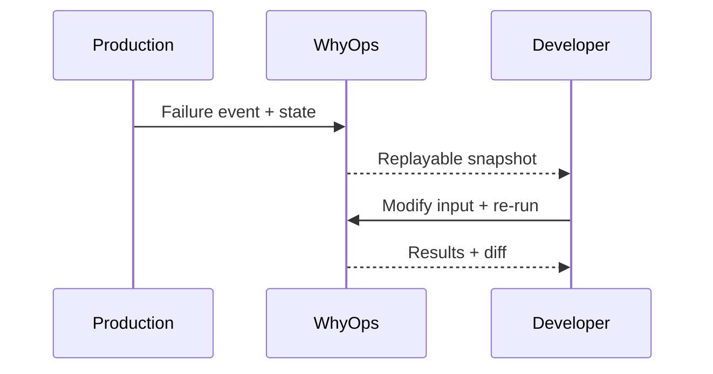

State replay turns production failures into debuggable sessions by recreating the decision environment.

## What replay needs

- Prompt + tool definitions
- Memory retrieval results
- Planner state + runtime limits
- Tool outputs and errors

<CardGroup cols={2}>
  <Card title="Why it matters" icon="bug">
    You can’t fix what you can’t reproduce.
  </Card>
  <Card title="Why it’s hard" icon="triangle-exclamation">
    Most state never appears in the prompt.
  </Card>
</CardGroup>
