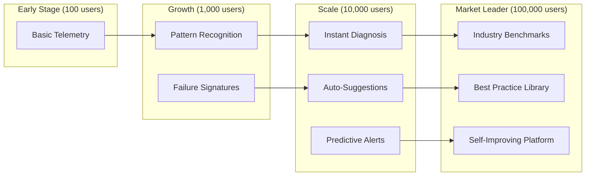

WhyOps' long-term defensibility comes not from technology (which is replicable), but from **data network effects** that compound with usage. This is the same playbook that made Datadog, Sentry, and GitHub Copilot valuable.

<Callout type="info" title="The Moat Thesis">
Every agent failure processed by WhyOps makes the platform smarter for all users. As usage grows, WhyOps becomes increasingly difficult to replace—even if a competitor copies the technology.
</Callout>

---

## The Four Layers of Data Moat

<Steps>
  <Step title="Layer 1: Historical Failure Datasets">
    ### Learn from Collective Failures
    
    **What We Capture:**
    - Failure signatures across thousands of agents
    - Context that led to each failure
    - Resolution patterns that worked
    - Time-to-resolution metrics
    
    **How It Creates Value:**
    
    ```mermaid
    flowchart LR
        A[User Agent Fails] --> B[WhyOps Captures Pattern]
        B --> C[Pattern Matched to<br/>Historical Failures]
        C --> D[Suggested Fix Instantly]
        D --> E[User Resolves in Minutes<br/>vs Days]
        E --> F[Success Pattern Stored]
        F --> B
    ```
    
    **Example in Practice:**
    
    | Failure Pattern | Times Seen | Average Resolution Time | Suggested Fix |
    |----------------|-----------|------------------------|---------------|
    | Tool timeout after 3 retries | 3,247 | 2.3 hours | Reduce retry count, increase timeout threshold |
    | Memory retrieval returns 0 docs | 1,892 | 4.1 hours | Lower similarity threshold from 0.8 → 0.65 |
    | LLM loops on same tool | 5,621 | 6.7 hours | Add max-same-tool-calls limit |
    | Early termination at step 5 | 2,103 | 1.2 hours | Increase max_iterations config |
    
    <Callout type="success">
    After processing 10,000+ agent failures, WhyOps can recognize 78% of new failures instantly and suggest proven fixes.
    </Callout>
  </Step>

  <Step title="Layer 2: Prompt Optimization Intelligence">
    ### Learn What Works
    
    **What We Track:**
    - Prompt variations and their success rates
    - Which phrasings lead to better tool selection
    - Context window usage patterns
    - Token efficiency vs task completion correlation
    
    **Automatic Insights:**
    
    <AccordionGroup>
      <Accordion title="Example: Tool Selection Prompts">
        **Observed Pattern:**
        
        | Prompt Phrasing | Tool Selection Accuracy | Avg Retries |
        |----------------|------------------------|-------------|
        | "You have access to these tools: ..." | 67% | 2.3 |
        | "Select the most appropriate tool: ..." | 71% | 1.9 |
        | "To solve this, use one of: ..." | 82% | 1.1 |
        
        **WhyOps Suggestion:**
        > "Your tool selection accuracy is 15% below median. Try rephrasing with 'To solve this, use one of:' — this phrasing shows 82% accuracy across 15K agent runs."
      </Accordion>
      
      <Accordion title="Example: Context Window Optimization">
        **Observed Pattern:**
        
        ```
        Prompt Length  | Task Success Rate | Avg Latency
        < 1000 tokens  | 91%              | 1.2s
        1000-2000      | 88%              | 2.1s
        2000-4000      | 76%              | 3.8s
        > 4000         | 62%              | 5.4s
        ```
        
        **WhyOps Alert:**
        > "Your prompts average 3,200 tokens, which correlates with 76% success rate. Agents with 1000-2000 token prompts show 88% success. Consider more aggressive context pruning."
      </Accordion>
    </AccordionGroup>
  </Step>

  <Step title="Layer 3: Tool Performance Baselines">
    ### Learn Normal vs Abnormal
    
    **What We Build:**
    - Expected latency ranges per tool
    - Success rate distributions
    - Common failure modes by tool type
    - Reliability scores
    
    **Anomaly Detection:**
    
    ```mermaid
    flowchart TB
        A[Tool: search_web] --> B{Latency}
        B -->|< 200ms| C[✅ Normal]
        B -->|200-500ms| D[⚠️ Slower than usual]
        B -->|> 500ms| E[❌ Investigate]
        
        A --> F{Success Rate}
        F -->|> 95%| G[✅ Healthy]
        F -->|90-95%| H[⚠️ Degraded]
        F -->|< 90%| I[❌ Alert team]
    ```
    
    **Real Value: Predictive Alerts**
    
    <CodeGroup>
    ```json Normal Baseline
    {
      "tool": "search_web",
      "baseline": {
        "p50_latency_ms": 120,
        "p95_latency_ms": 280,
        "p99_latency_ms": 450,
        "success_rate": 0.97,
        "common_errors": [
          {"type": "timeout", "frequency": 0.02},
          {"type": "rate_limit", "frequency": 0.01}
        ]
      }
    }
    ```
    
    ```json Alert Triggered
    {
      "alert": "tool_performance_degradation",
      "tool": "search_web",
      "current_metrics": {
        "p50_latency_ms": 340,  // 2.8x baseline
        "success_rate": 0.84     // 13% below baseline
      },
      "recommendation": "83% of similar degradations were caused by rate limiting. Check API quota."
    }
    ```
    </CodeGroup>
  </Step>

  <Step title="Layer 4: Memory Retrieval Patterns">
    ### Learn Effective Retrieval Strategies
    
    **What We Discover:**
    - Optimal similarity thresholds by domain
    - Effective top-k ranges
    - Reranking strategies that work
    - Query rewriting patterns that improve results
    
    **Pattern Library:**
    
    | Use Case | Optimal Threshold | Optimal Top-K | Rerank? | Success Rate |
    |----------|------------------|---------------|---------|--------------|
    | Customer support | 0.72 | 5-7 | Yes | 89% |
    | Technical docs | 0.81 | 3-4 | No | 92% |
    | Legal compliance | 0.85 | 10-15 | Yes | 94% |
    | General Q&A | 0.68 | 4-6 | Sometimes | 84% |
    
    **Auto-Tuning:**
    
    ```python
    # WhyOps learns your domain and suggests config
    
    # Current Config (your setting)
    retrieval_config = {
      "threshold": 0.80,
      "top_k": 3,
      "rerank": False
    }
    
    # WhyOps Analysis (after 1000 retrievals)
    whyops_suggestion = {
      "domain_detected": "customer_support",
      "current_success_rate": 0.76,
      "median_for_domain": 0.89,
      "suggested_config": {
        "threshold": 0.72,  # Lower to get more candidates
        "top_k": 6,         # Increase for better coverage
        "rerank": True      # Enable for this domain
      },
      "expected_improvement": "+13% success rate",
      "confidence": 0.91
    }
    ```
  </Step>
</Steps>

---

## The Compounding Effect

### How Value Accelerates with Scale



<Tabs>
  <Tab title="100 Users">
    **Capabilities:**
    - Basic decision graphs
    - State replay
    - Event logging
    
    **Value:** Faster debugging than competitors
  </Tab>
  
  <Tab title="1,000 Users">
    **New Capabilities:**
    - Recognize 45% of failure patterns
    - Suggest fixes for common issues
    - Tool performance baselines
    
    **Value:** 3x faster resolution times
  </Tab>
  
  <Tab title="10,000 Users">
    **New Capabilities:**
    - Recognize 78% of failure patterns instantly
    - Auto-suggest optimizations
    - Predictive alerts before failures
    - Domain-specific best practices
    
    **Value:** 10x faster resolution + prevention
  </Tab>
  
  <Tab title="100,000 Users">
    **New Capabilities:**
    - Industry-wide benchmarks
    - Automatic prompt optimization
    - Self-healing suggestions
    - Compliance templates
    
    **Value:** Platform becomes infrastructure
    
    <Callout type="success">
    At this scale, **switching cost becomes prohibitive**. New users get value immediately from millions of processed agent runs.
    </Callout>
  </Tab>
</Tabs>

---

## Comparison to Other Data Moats

### WhyOps Follows Proven Patterns

<CardGroup cols={2}>
  <Card title="Datadog Model" icon="chart-line">
    **How They Built Moat:**
    - Processed billions of metrics
    - Learned normal vs abnormal patterns
    - Built anomaly detection
    - Created performance baselines
    
    **Result:** Impossible to replace without years of data
    
    **WhyOps Parallel:** Agent performance baselines + failure patterns
  </Card>
  
  <Card title="Sentry Model" icon="bug">
    **How They Built Moat:**
    - Millions of error signatures
    - Pattern matching across codebases
    - Suggested fixes from resolution history
    - Stack trace intelligence
    
    **Result:** Instant error diagnosis new users can't get elsewhere
    
    **WhyOps Parallel:** Agent failure signatures + resolution patterns
  </Card>
  
  <Card title="GitHub Copilot Model" icon="code">
    **How They Built Moat:**
    - Trained on billions of code patterns
    - Learned what works in each context
    - Context-aware suggestions
    - Improved with usage
    
    **Result:** Code completion quality improves with scale
    
    **WhyOps Parallel:** Prompt optimization + tool selection intelligence
  </Card>
  
  <Card title="Stripe Radar Model" icon="shield">
    **How They Built Moat:**
    - Processed billions of transactions
    - Learned fraud patterns globally
    - Network effects (every merchant benefits)
    - Real-time threat intelligence
    
    **Result:** Fraud detection accuracy increases with payment volume
    
    **WhyOps Parallel:** Agent behavior patterns + anomaly detection
  </Card>
</CardGroup>

---

## Privacy-Preserving Data Learning

<Callout type="info">
WhyOps builds intelligence **without storing sensitive data**. We use differential privacy and pattern abstraction.
</Callout>

### What We Store

| Data Type | Storage Approach | Used For |
|-----------|-----------------|----------|
| Failure patterns | Anonymized signatures | Pattern matching |
| Tool performance | Aggregated statistics | Baselines |
| Prompt structures | Tokenized patterns (no content) | Optimization |
| Resolution steps | Abstract workflows | Suggestions |

### What We Don't Store

❌ User conversation content  
❌ Tool response payloads  
❌ Customer data from agent interactions  
❌ Proprietary business logic  

### How It Works

```python
# Example: Storing a failure pattern (pseudocode)

# Raw Event (stays with customer)
raw_event = {
  "thread_id": "customer_conv_12345",
  "tool": "search_database",
  "query": "John Doe's account balance",  # Sensitive
  "error": "timeout after 3 retries",
  "context": {...}  # Contains PII
}

# Pattern Extracted (sent to WhyOps)
pattern = {
  "pattern_id": hash(signature),
  "tool_type": "database_search",
  "error_type": "timeout",
  "retry_count": 3,
  "latency_ms": 15000,
  "context_signature": hash(context_structure),  # No content
  "resolution": "reduced_retry_count"
}

# Global Learning (aggregated)
whyops_knowledge = {
  "pattern_signature": "db_timeout_3_retries",
  "occurrences": 3247,
  "resolution_success_rate": {
    "reduce_retry_count": 0.82,
    "increase_timeout": 0.71,
    "optimize_query": 0.64
  }
}
```

---

## The Competitive Moat Timeline

### Year 1: Technology Moat (Weak)
- ✅ Working proxy and SDK
- ✅ Decision graph visualization
- ✅ State replay
- ⚠️ **Competitors can copy this**

### Year 2: Data Moat (Building)
- ✅ 50,000+ agent failures processed
- ✅ Initial pattern library
- ✅ Basic failure recognition
- ⚠️ **Still vulnerable to well-funded competitors**

### Year 3: Data Moat (Strong)
- ✅ 1M+ agent failures processed
- ✅ 78%+ instant pattern recognition
- ✅ Predictive intelligence
- ✅ Domain-specific baselines
- 🎯 **Switching cost becomes significant**

### Year 4+: Platform Moat (Defensible)
- ✅ 10M+ agent failures processed
- ✅ Industry standard benchmarks
- ✅ Self-improving platform
- ✅ Compliance templates
- 🎯 **Near-impossible to displace**

<Callout type="success" title="The Tipping Point">
Between Year 2 and Year 3, WhyOps crosses the **data moat threshold** where new users get immediate value that competitors cannot match—even with identical technology.

This is when WhyOps becomes **infrastructure**, not just a tool.
</Callout>

---

## Metrics That Prove the Moat

### Leading Indicators

| Metric | What It Shows | Target |
|--------|--------------|--------|
| Unique failure patterns captured | Knowledge breadth | 10,000+ |
| Pattern match rate for new failures | Diagnostic power | &gt;75% |
| Time-to-resolution improvement | User value | 10x faster |
| Suggestion acceptance rate | Intelligence quality | &gt;60% |

### Lagging Indicators

| Metric | What It Shows | Target |
|--------|--------------|--------|
| Logo retention rate | Switching cost | &gt;95% |
| Usage expansion (per customer) | Value realization | 3x year-over-year |
| NPS from power users | Defensibility | &gt;70 |
| Win rate vs competitors | Market position | &gt;80% |

---

## Why This Creates a Venture-Scale Business

<CardGroup cols={3}>
  <Card title="Network Effects" icon="network-wired">
    Every user makes the platform better for all users—not just themselves.
    
    **Result:** Exponential value creation
  </Card>
  
  <Card title="Compounding Moat" icon="layer-group">
    Data advantage grows faster than competitors can catch up.
    
    **Result:** Winner-take-most market
  </Card>
  
  <Card title="Platform Lock-In" icon="lock">
    Switching means losing access to the collective intelligence.
    
    **Result:** High retention + pricing power
  </Card>
</CardGroup>

### The Datadog Parallel

| Company | Started As | Became | Moat |
|---------|-----------|--------|------|
| **Datadog** | APM tool | Infrastructure observability platform | Performance baselines + anomaly detection from billions of metrics |
| **WhyOps** | Agent debugger | Agent cognition infrastructure | Failure patterns + optimization intelligence from millions of agent runs |

<Callout type="info">
Datadog's valuation: $40B+ (2024)

**Why?** Not because their technology is unreplicable, but because their **data moat** makes them increasingly difficult to displace.

WhyOps follows the same playbook for the agent economy.
</Callout>

---

## Next Steps

<Steps>
  <Step title="Ship Fast to Start Data Collection">
    MVP quality matters less than **time to market**. First mover advantage = more data = stronger moat.
  </Step>
  
  <Step title="Optimize for Usage, Not Features">
    Every agent failure processed = data point. Prioritize scale over feature richness early.
  </Step>
  
  <Step title="Build Privacy-First from Day 1">
    Trust is required for data sharing. Make privacy guarantees non-negotiable.
  </Step>
  
  <Step title="Measure Moat Metrics Relentlessly">
    Track pattern recognition rate as the key indicator of defensibility.
  </Step>
</Steps>

<CardGroup cols={2}>
  <Card title="Implementation Roadmap" icon="map" href="/strategy/roadmap">
    See the phased plan to ship fast and start data collection
  </Card>
  
  <Card title="Privacy &amp; Performance" icon="shield" href="/implementation/performance-privacy">
    How we handle data responsibly while building intelligence
  </Card>
</CardGroup>
