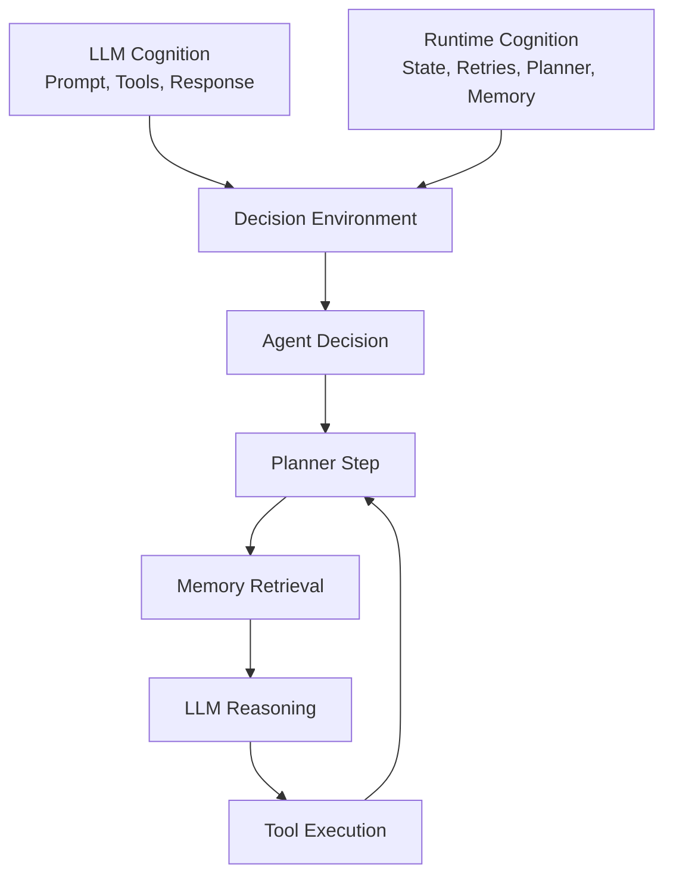

# Core System Model

WhyOps is built on a simple but crucial discovery: **LLMs are stateless, agents are stateful.**

## Two layers of reality

<CardGroup cols={2}>
  <Card title="LLM Cognition" icon="message">
    Visible in prompts and responses. Capturable via a proxy.
  </Card>
  <Card title="Runtime Cognition" icon="gear">
    Hidden state: retries, memory mutation, planner state, termination rules.
  </Card>
</CardGroup>

## The four cognitive boundaries

1. **Planner step** — agent decides next action.
2. **Memory retrieval** — past knowledge influences decision.
3. **LLM reasoning** — model produces action or response.
4. **Tool execution** — external world interaction.

<Callout type="info">
Instrumenting these boundaries reconstructs the full cognition loop without deep framework coupling.
</Callout>
