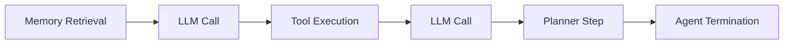

WhyOps uses a small set of canonical event types mapped to decision boundaries.

<CardGroup cols={3}>
  <Card title="LLM Call" icon="message" href="/events/llm-call">LLM cognition boundary.</Card>
  <Card title="Tool Execution" icon="plug" href="/events/tool-execution">Execution reality boundary.</Card>
  <Card title="Memory Retrieval" icon="database" href="/events/memory-retrieval">Knowledge influence boundary.</Card>
  <Card title="Planner Step" icon="route" href="/events/planner-step">Strategy boundary.</Card>
  <Card title="Agent Termination" icon="stop" href="/events/agent-termination">Stop reason boundary.</Card>
</CardGroup>

## Linking events

Every event includes thread and step metadata to reconstruct a DAG.

- `thread_id` links a decision journey.
- `step_id` and `parent_step` establish causality.
- `span_id` allows tool spans and retries.
