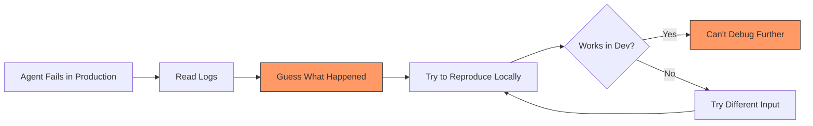
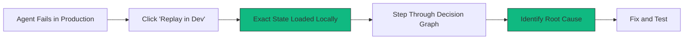

State Replay is WhyOps' most powerful feature—it transforms agent observability from "what happened" logs into **executable debugging sessions**.

<Callout type="success" title="The Killer Value Prop">
**"Your agent failed in production at 3am. Click here to replay it in your local dev environment."**

This single feature justifies WhyOps' existence.
</Callout>

---

## The Problem State Replay Solves

### Traditional Debugging Flow (Broken)



**Time to Debug:** 4-6 hours (or days)  
**Success Rate:** ~60%  
**Frustration Level:** Extreme

### WhyOps State Replay Flow (Fixed)



**Time to Debug:** 5-15 minutes  
**Success Rate:** ~95%  
**Frustration Level:** None

---

## What Gets Replayed

<Tabs>
  <Tab title="Complete Decision Environment">
    ### Every Variable That Influenced the Decision
    
    <AccordionGroup>
      <Accordion title="LLM Context State">
        - System prompts (exact versions)
        - Conversation history
        - Tool definitions available
        - Model configuration (temperature, max_tokens, etc.)
        - Provider and model version
      </Accordion>
      
      <Accordion title="Memory State">
        - Documents in vector DB at that moment
        - Embeddings used for retrieval
        - Similarity scores
        - Filter configurations
        - Query rewriting rules active
      </Accordion>
      
      <Accordion title="Tool Availability">
        - Which tools were registered
        - Tool schemas and descriptions
        - API keys/credentials state (redacted but noted)
        - Rate limit status
        - Tool override rules
      </Accordion>
      
      <Accordion title="Planner Configuration">
        - Max iterations setting
        - Timeout configuration
        - Retry policies
        - Strategy selection rules
        - Termination conditions
      </Accordion>
      
      <Accordion title="Framework State">
        - Framework version
        - Configuration files
        - Environment variables (sanitized)
        - Active middleware/plugins
      </Accordion>
    </AccordionGroup>
  </Tab>
  
  <Tab title="Execution Snapshot">
    ### The Exact Sequence of Events
    
    ```json
    {
      "replay_snapshot": {
        "thread_id": "prod_t_47293",
        "timestamp": "2026-01-30T03:42:17Z",
        "step_count": 7,
        "failure_step": 5,
        
        "events": [
          {
            "step": 1,
            "type": "memory_retrieval",
            "query": "customer refund policy",
            "docs_retrieved": 3,
            "state_at_step": {...}
          },
          {
            "step": 2,
            "type": "llm_call",
            "prompt_tokens": 1247,
            "response": "...",
            "state_at_step": {...}
          },
          {
            "step": 3,
            "type": "tool_execution",
            "tool": "search_orders",
            "attempt": 1,
            "success": true,
            "state_at_step": {...}
          },
          {
            "step": 4,
            "type": "llm_call",
            "response": "...",
            "state_at_step": {...}
          },
          {
            "step": 5,
            "type": "tool_execution",
            "tool": "process_refund",
            "attempt": 1,
            "error": "insufficient_permissions",  // ← Failure
            "state_at_step": {...}
          }
        ]
      }
    }
    ```
  </Tab>
  
  <Tab title="NOT Replayed (Privacy)">
    ### What We Intentionally Exclude
    
    ❌ **Never Replayed:**
    - Customer PII (names, emails, addresses)
    - Payment information
    - API keys/secrets (we note they existed, not values)
    - Proprietary business data in tool outputs
    
    ✅ **Instead:**
    - Anonymized/redacted equivalents
    - Structural signatures (same shape, fake data)
    - Configuration state (what was enabled, not secrets)
    
    <Callout type="info">
    State Replay gives you **decision reproducibility** without **data exposure**.
    </Callout>
  </Tab>
</Tabs>

---

## How State Replay Works

### Step-by-Step Mechanics

<Steps>
  <Step title="Capture: Production Failure Occurs">
    ```json
    // Agent fails at step 5
    {
      "thread_id": "prod_t_47293",
      "status": "failed",
      "failure_step": 5,
      "error": "tool_execution_error",
      "captured_state": {
        "full_decision_graph": [...],
        "environment_snapshot": {...},
        "configuration": {...}
      }
    }
    ```
  </Step>
  
  <Step title="Snapshot: Decision State Saved">
    WhyOps freezes the **complete cognitive state** at each step:
    
    - What was in the prompt
    - What was in memory
    - What tools were available
    - What configuration was active
    - What the planner state was
  </Step>
  
  <Step title="Export: Generate Replay Package">
    ```bash
    # In WhyOps UI
    → Click "Replay in Dev"
    → Downloads replay package
    
    # replay_prod_t_47293.json
    {
      "replay_format_version": "1.0",
      "sanitized": true,
      "thread_snapshot": {...},
      "instructions": "..."
    }
    ```
  </Step>
  
  <Step title="Load: Import in Dev Environment">
    ```python
    # In your dev environment
    from whyops import replay
    
    session = replay.load("replay_prod_t_47293.json")
    
    # Session is now in the EXACT state as production failure
    print(session.current_step)  # 5 (the failure step)
    print(session.environment)   # Same config as prod
    ```
  </Step>
  
  <Step title="Debug: Step Through Execution">
    ```python
    # Interactive debugging
    session.step_backward()  # Go to step 4
    session.inspect_memory()  # See what docs were retrieved
    session.inspect_tools()   # See what tools were available
    
    # Execute with modifications
    session.override_tool_config("process_refund", {
      "permissions_check": False  # Test hypothesis
    })
    
    result = session.execute_step(5)
    # Now you can see if permissions were the root cause
    ```
  </Step>
  
  <Step title="Fix: Resolve and Validate">
    ```python
    # Identified root cause: permissions check failing
    
    # Test fix locally
    session.reset_to_step(1)
    session.apply_fix({
      "type": "config_change",
      "tool": "process_refund",
      "change": "enable_elevated_permissions"
    })
    
    result = session.replay_full()
    assert result.success == True  # Fix validated
    
    # Push fix to production
    session.export_fix("apply_to_prod.yaml")
    ```
  </Step>
</Steps>

---

## Real-World Example: Debugging a Production Failure

### Scenario

**Production Issue:**
- Customer service agent fails to process refunds
- Happens only for orders > $500
- Works fine in development
- Logs show "tool_execution_error" with no details

### Without State Replay (Traditional Debugging)

```
11:00 - Engineer sees alert
11:15 - Checks logs (no useful info)
11:30 - Tries to reproduce with test data (works fine)
12:00 - Checks production DB (can't find pattern)
13:00 - Adds more logging, redeploys
14:00 - Waits for failure to happen again
15:30 - Failure occurs, new logs collected
16:00 - Discovers it's a permissions issue
16:30 - Fixes and validates
17:00 - Deploy fix

Time: 6 hours
```

### With WhyOps State Replay

```
11:00 - Engineer sees alert
11:03 - Opens WhyOps, finds failed thread
11:04 - Clicks "Replay in Dev"
11:05 - Loads replay snapshot locally
11:07 - Steps through decision graph
11:08 - Sees tool call failed at step 5
11:09 - Inspects tool config: permissions_check=true
11:10 - Inspects order data: amount=$523 (> $500 threshold)
11:12 - Finds config: large_orders_require_manager_approval=true
11:15 - Root cause identified: missing manager approval workflow
11:30 - Implements fix
11:45 - Validates with replay (now works)
12:00 - Deploy fix

Time: 1 hour
```

**6x faster resolution** with State Replay

---

## Developer Experience

### UI Flow

<Tabs>
  <Tab title="Step 1: Find Failure">
    ```
    WhyOps Dashboard
    ┌─────────────────────────────────────────────┐
    │ Failed Agent Threads (Last 24h)            │
    ├─────────────────────────────────────────────┤
    │ ❌ prod_t_47293  |  3:42am  |  5 steps     │
    │    Error: tool_execution_error              │
    │    Tool: process_refund                     │
    │    [View Details] [Replay in Dev] ← Click   │
    ├─────────────────────────────────────────────┤
    │ ❌ prod_t_47291  |  2:18am  |  3 steps     │
    │    Error: timeout                           │
    └─────────────────────────────────────────────┘
    ```
  </Tab>
  
  <Tab title="Step 2: Download Replay">
    ```
    Replay Package Generator
    ┌─────────────────────────────────────────────┐
    │ Thread: prod_t_47293                        │
    │ Failed at: Step 5                           │
    │ Error: tool_execution_error                 │
    │                                             │
    │ Privacy Options:                            │
    │ ☑ Sanitize PII                             │
    │ ☑ Redact API keys                          │
    │ ☑ Anonymize customer data                  │
    │ ☐ Include raw tool outputs (not recommended)│
    │                                             │
    │ [Generate Replay Package]                   │
    └─────────────────────────────────────────────┘
    
    → Downloads: replay_prod_t_47293.json
    ```
  </Tab>
  
  <Tab title="Step 3: Load Locally">
    ```python
    # In terminal
    $ whyops replay load replay_prod_t_47293.json
    
    ✓ Loaded thread prod_t_47293
    ✓ Sanitized data verified
    ✓ Snapshot contains 5 steps
    ✓ Failure at step 5
    
    Replay session ready. Use:
      whyops replay inspect    # View decision graph
      whyops replay step 3     # Jump to specific step
      whyops replay run        # Re-execute full thread
    ```
  </Tab>
  
  <Tab title="Step 4: Debug Interactively">
    ```python
    $ whyops replay inspect --step 5
    
    Step 5: Tool Execution (FAILED)
    ┌────────────────────────────────────────────┐
    │ Tool: process_refund                       │
    │ Attempt: 1                                 │
    │ Error: insufficient_permissions            │
    │                                            │
    │ Tool Config:                               │
    │   permissions_check: true                  │
    │   require_approval_threshold: 500          │
    │                                            │
    │ Input Args:                                │
    │   order_id: ord_xyz123                     │
    │   amount: 523.00  ← Above threshold        │
    │   reason: "damaged goods"                  │
    │                                            │
    │ Decision Context:                          │
    │   - No manager approval in workflow        │
    │   - Agent lacks elevated permissions       │
    │                                            │
    │ Suggested Fix:                             │
    │   Add approval step before refund tool     │
    └────────────────────────────────────────────┘
    ```
  </Tab>
</Tabs>

---

## Advanced Replay Features

<CardGroup cols={2}>
  <Card title="Time-Travel Debugging" icon="clock">
    **Step backward through decisions:**
    
    ```python
    session.step_to(3)        # Jump to step 3
    session.inspect_state()   # See state then
    session.step_forward()    # Go to step 4
    session.compare_state(3, 4)  # Diff
    ```
  </Card>
  
  <Card title="Hypothesis Testing" icon="flask">
    **Modify state and re-execute:**
    
    ```python
    session.override_memory({
      "add_docs": ["doc_123"],
      "remove_docs": ["doc_456"]
    })
    session.replay_from_step(2)
    ```
  </Card>
  
  <Card title="Diff Comparison" icon="code-compare">
    **Compare two failure modes:**
    
    ```python
    replay.compare(
      "replay_prod_t_47293.json",
      "replay_prod_t_47291.json"
    )
    # Shows what was different between failures
    ```
  </Card>
  
  <Card title="Batch Replay" icon="list">
    **Test fix across multiple failures:**
    
    ```python
    failures = replay.load_batch([
      "replay_1.json",
      "replay_2.json", 
      "replay_3.json"
    ])
    
    fix = {...}
    results = failures.apply_fix(fix)
    # See if fix works for all cases
    ```
  </Card>
</CardGroup>

---

## Why This is a Category-Defining Feature

<Callout type="success" title="Paradigm Shift">
State Replay moves agent observability from the **monitoring category** into the **debugging tools category**—which has much higher willingness to pay.
</Callout>

### Comparison to Other Debugging Tools

| Tool Category | Example | What It Replays | WhyOps Equivalent |
|--------------|---------|----------------|-------------------|
| **Time-travel debuggers** | rr, Undo | CPU instructions, memory, syscalls | Agent decision steps, cognitive state |
| **Error replay (web)** | LogRocket, FullStory | User clicks, browser state, network | Tool calls, memory retrievals, planner state |
| **Crash reporters** | Sentry | Stack trace, breadcrumbs, context | Decision graph, event timeline, environment |

**WhyOps is the first "time-travel debugger for agent cognition"**

---

## User Testimonials (Future)

> "State Replay cut our agent debugging time from 4 hours to 15 minutes. It's like having a DVR for agent failures."  
> — *Engineering Lead, AI Startup*

> "The ability to step through production agent decisions locally is game-changing. We finally understand why our agents fail."  
> — *CTO, Enterprise AI Team*

> "I can't imagine debugging agents without State Replay anymore. It's that fundamental."  
> — *AI Researcher*

---

## Technical Implementation

<Accordion title="How We Build State Replay">
  
  ### Snapshot Strategy
  
  1. **Event Sourcing:** Every cognitive event is immutable and stored
  2. **State Reconstruction:** Decision graph can be rebuilt from events
  3. **Deterministic Replay:** Same inputs + same config = same execution path
  
  ### Challenges Solved
  
  | Challenge | Solution |
  |-----------|----------|
  | Non-deterministic LLMs | Capture LLM responses, replay those instead of re-calling |
  | External state (databases) | Snapshot relevant queries/results at capture time |
  | Time-dependent logic | Freeze timestamps and replay with original times |
  | API rate limits | Use mocked responses from original execution |
  
  ### Privacy Guarantees
  
  - **Differential Privacy:** Sanitize PII automatically
  - **User Control:** Choose what to include in replay
  - **Local-First:** Replay packages can stay on-premise
  - **Audit Trail:** Track what was included in snapshots
</Accordion>

---

## Next Steps

<Steps>
  <Step title="Understand the Architecture">
    See how State Replay is built: [Architecture → State Replay](/architecture/state-replay)
  </Step>
  
  <Step title="Review Event Schema">
    Learn what events enable replay: [Event Schema](/events/overview)
  </Step>
  
  <Step title="Check Implementation Plan">
    See when this ships: [Implementation Roadmap](/strategy/roadmap)
  </Step>
</Steps>

<CardGroup cols={2}>
  <Card title="Decision Graph Visualization" icon="diagram-project" href="/architecture/decision-graph">
    See how State Replay builds on decision graphs
  </Card>
  
  <Card title="Use Case: Silent Retries" icon="rotate" href="/use-cases/silent-retries">
    Example of debugging with State Replay
  </Card>
</CardGroup>
