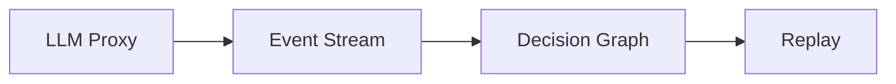

Goals:
- LLM proxy capture
- Tool call detection
- Decision graph from inferred steps
- Replay from LLM-visible state

<Callout type="warning">
This phase is planned. There is no proxy yet.
</Callout>
