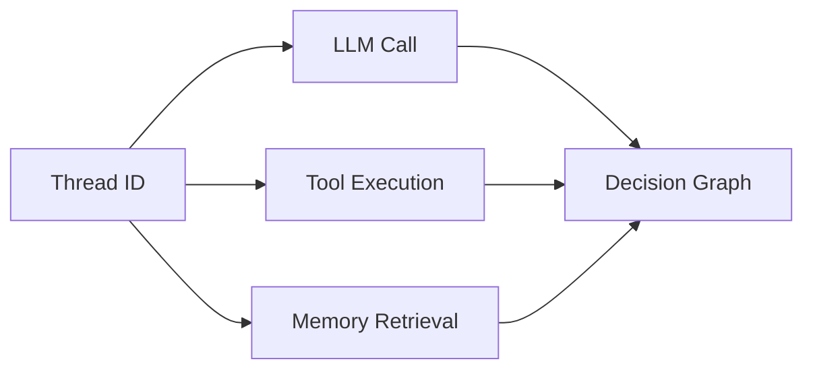

Correctness depends on linking every event to a thread and step.

## Design goals

- Automatic thread_id injection
- Step lineage for retries and sub-calls
- No manual context passing

```mermaid
flowchart LR
  A[Thread ID] --> B[LLM Call]
  A --> C[Tool Execution]
  A --> D[Memory Retrieval]
  B --> E[Decision Graph]
  C --> E
  D --> E
```
