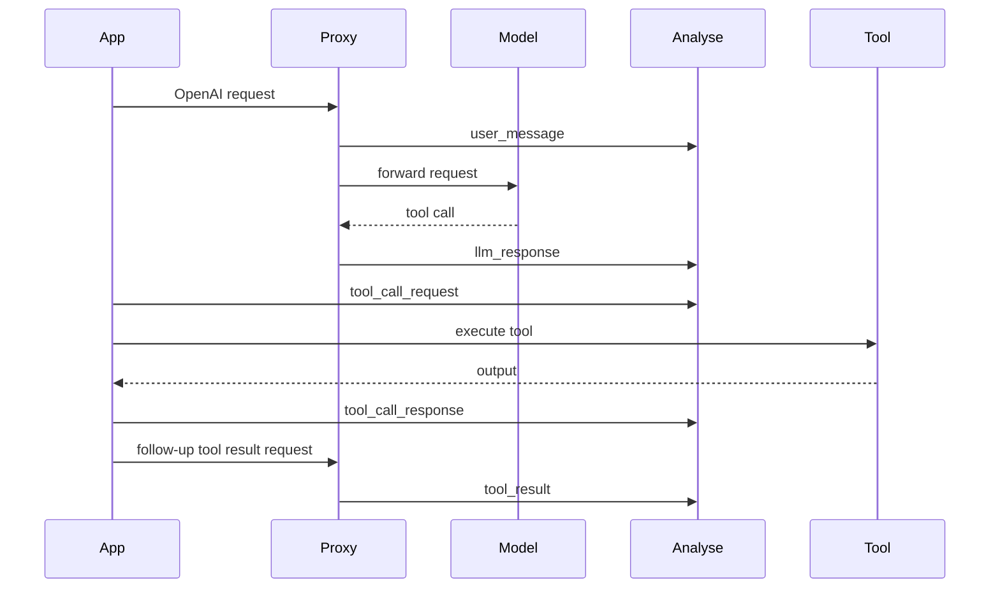

Use this page when you need the exact payload shape for a given event type or you are building your own runtime instrumentation without one of the SDK helpers.

<CardGroup cols={2}>
  <Card title="Manual Events Overview" icon="terminal" href="/integrations/manual-events">
    Start with the ingest endpoint, auth flow, queue behavior, and event schema summary.
  </Card>
  <Card title="Agent Registration" icon="fingerprint" href="/integrations/agent-init">
    Register the agent first so manual events bind cleanly to the right versioned configuration.
  </Card>
</CardGroup>

## Event payloads

<Tabs>
  <Tab title="Conversation events">
    **`user_message`**

    Use for the assembled chat history or final prompt input your orchestrator produced.

    ```json
    [
      { "role": "system", "content": "You are helpful." },
      { "role": "user", "content": "Where is my order?" }
    ]
    ```

    ```json
    {
      "systemPrompt": "You are helpful.",
      "tools": [{ "name": "search_orders" }],
      "params": { "temperature": 0.2 }
    }
    ```

    **`llm_response`**

    Requires `metadata.model` and `metadata.provider`.

    ```json
    {
      "content": "Your order has shipped.",
      "toolCalls": [],
      "finishReason": "stop"
    }
    ```

    ```json
    {
      "content": null,
      "toolCalls": [
        {
          "function": {
            "name": "search_orders",
            "arguments": "{\"orderId\":\"123\"}"
          }
        }
      ],
      "finishReason": "tool_calls"
    }
    ```
  </Tab>
  <Tab title="Embedding + thinking">
    **`embedding_request`**

    ```json
    {
      "input": ["refund policy", "shipping times"]
    }
    ```

    **`embedding_response`**

    ```json
    {
      "model": "text-embedding-3-large",
      "provider": "openai",
      "usage": { "totalTokens": 32 },
      "latencyMs": 180
    }
    ```

    ```json
    {
      "object": "list",
      "embeddingCount": 2,
      "firstEmbeddingDimensions": 3072,
      "encodingFormat": "float"
    }
    ```

    **`llm_thinking`**

    ```json
    {
      "type": "thinking",
      "thinking": "Need to verify the order ID before answering.",
      "signature": "sig_abc123"
    }
    ```
  </Tab>
  <Tab title="Tool + error events">
    **`tool_call`**

    Legacy combined event. The backend splits it into `tool_call_request` and `tool_call_response` with a shared `spanId`.

    ```json
    {
      "toolCalls": [{ "name": "search_orders", "arguments": { "orderId": "123" } }],
      "toolResults": { "status": "shipped" }
    }
    ```

    **`tool_call_request`**

    Requires `metadata.tool`.

    ```json
    {
      "toolCalls": [{ "name": "search_orders", "arguments": { "orderId": "123" } }],
      "requestedAt": "2024-03-20T12:00:00.000Z"
    }
    ```

    **`tool_call_response`**

    ```json
    {
      "toolCalls": [{ "name": "search_orders", "arguments": { "orderId": "123" } }],
      "toolResults": { "status": "shipped", "carrier": "UPS" },
      "respondedAt": "2024-03-20T12:00:00.242Z"
    }
    ```

    **`tool_result`** and **`error`**

    ```json
    { "toolName": "search_orders", "output": { "status": "shipped" } }
    ```

    ```json
    { "message": "Tool timed out", "status": 504 }
    ```
  </Tab>
</Tabs>

## Runtime patterns

<Steps>
  <Step title="Proxy only">
    Send no manual events if the proxy already gives you the LLM visibility you need.
  </Step>
  <Step title="Full tool observability">
    Emit `tool_call_request` before execution and `tool_call_response` after completion, then optionally `tool_result` when the output is passed back to the model.
  </Step>
  <Step title="Internal retries">
    Use a different `spanId` per retry so the graph can show the retry pattern instead of collapsing multiple attempts together.
  </Step>
</Steps>



## Idempotency and binding

- If you provide `idempotencyKey`, WhyOps uses it to skip duplicates.
- If you do not provide one, WhyOps may derive one from a content hash for most event types.
- `tool_call_request` and `tool_call_response` intentionally skip content-hash dedup because repeated calls can be legitimate retries.
- The first event for a new trace auto-creates the trace and binds it to the latest registered agent version for that `agentName`.
- If the same `traceId` later resolves to a different agent version, WhyOps returns a conflict to protect trace consistency.

## Best practices

- Reuse the exact same `spanId` between `tool_call_request` and `tool_call_response`.
- Include `metadata.latencyMs` whenever you measure provider or tool execution time.
- Batch events to `/api/events/ingest` when you want lower network overhead.
- Register agents explicitly with [Agent Init and Registration](/integrations/agent-init) before sending traffic.
- Always send `metadata.model` and `metadata.provider` for `llm_response` and `embedding_response`.
