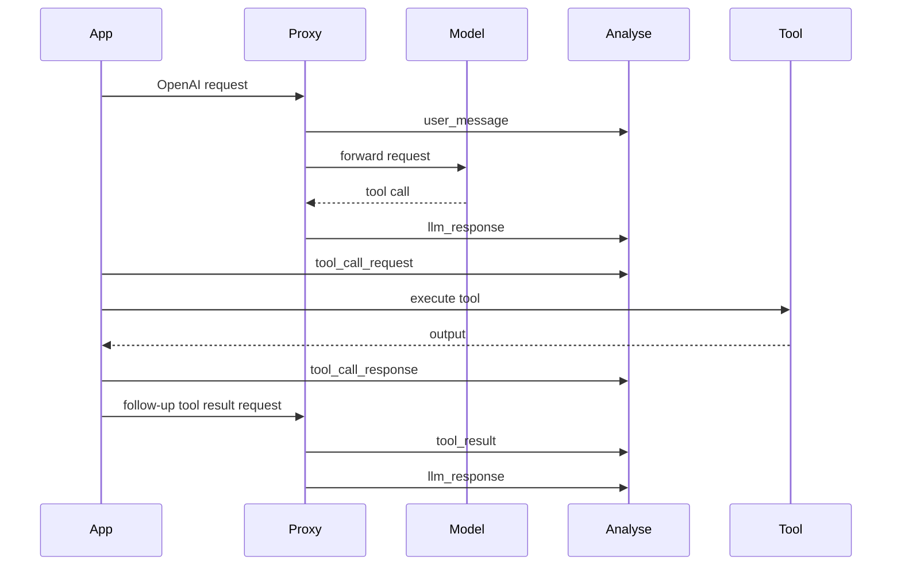

While the WhyOps Proxy is the easiest way to instrument your agents automatically, you may have custom tools, non-LLM reasoning steps, or internal framework logic that you want to visualize in your decision graph.

You can send events directly to the `whyops-analyse` service using our REST API.

## When to use manual events

Use manual events for anything the proxy cannot see by itself:

- your actual tool execution input/output
- retries inside your framework
- orchestration steps outside the LLM boundary
- runtime crashes after the LLM asked for a tool
- internal thinking blocks or planning state you choose to expose

## Endpoint Overview

**Base URL**: `https://api.whyops.com/api` (or your self-hosted URL)

**Authentication**: 
You must include an API key generated from the WhyOps Dashboard in the `Authorization` header.
```http
Authorization: Bearer <WHYOPS_API_KEY>
```

The API key automatically resolves your `userId`, `projectId`, and `environmentId`.

If you do not use API key auth, you must send all of these headers manually:

```http
X-User-Id: <uuid>
X-Project-Id: <uuid>
X-Environment-Id: <uuid>
```

## The ingestion pipeline

```mermaid
flowchart LR
  A[Your App or Worker] --> B[/api/events/ingest]
  B --> C[Redis Stream Queue]
  C --> D[Analyse Worker]
  D --> E[EventService.processEvent]
  E --> F[TraceService.ensureTraceExists]
  F --> G[Postgres: traces + trace_events]
  G --> H[UI graphs, analytics, analyses]
```

### What happens on ingest

When you send an event to `/api/events/ingest`:

1. WhyOps validates the payload with Zod.
2. It merges auth context from API key or explicit headers.
3. It attempts to enqueue the event into the Redis stream.
4. The analyse worker reads the queue and processes events sequentially per trace.
5. Sampling is resolved at the trace level.
6. The trace is created if needed.
7. Step IDs, parent IDs, and span IDs are resolved when absent.
8. The event is persisted to `trace_events`.

If queueing is unavailable, the controller falls back to direct synchronous processing.

## Ingesting Events

Use the `/events/ingest` endpoint to send one or more events.

### `POST /api/events/ingest`

Accepts a single event object or an array of event objects.

<Tabs>
  <Tab title="Request">
    ```bash
    curl -X POST https://api.whyops.com/api/events/ingest \
      -H "Authorization: Bearer YOUR_API_KEY" \
      -H "Content-Type: application/json" \
      -d '{
        "traceId": "123e4567-e89b-12d3-a456-426614174000",
        "spanId": "tool-call-1",
        "eventType": "tool_call_request",
        "agentName": "my-customer-support-agent",
        "timestamp": "2024-03-20T12:00:00Z",
        "content": {
          "toolCalls": [
            {
              "name": "search_database",
              "arguments": { "query": "latest orders" }
            }
          ]
        },
        "metadata": {
          "tool": "search_database"
        }
      }'
    ```
  </Tab>
</Tabs>

### Response behavior

- `202 Accepted` when the event was queued successfully
- `201 Created` when it falls back to direct processing
- `400` for validation or missing auth context
- `409` when a trace is already bound to a different agent version

Typical queued response:

```json
{
  "success": true,
  "accepted": true,
  "queuedCount": 1
}
```

## Other useful endpoints

### `POST /api/events`

Processes events directly instead of queue-first. Same payload shape.

### `POST /api/events/tool-result`

Convenience endpoint that automatically sets `eventType: "tool_call_response"`.

Use this when you only want to submit tool outputs and do not want to specify the event type yourself.

### `GET /api/events/help`

Returns the machine-readable help payload the backend exposes for supported event types.

### `GET /api/events?traceId=...&include=content,metadata`

Lists stored events.

### `GET /api/events/:id?include=content,metadata`

Fetches one stored event.

## Event Schema

Every event you send must conform to this schema:

| Field | Type | Required | Description |
|-------|------|----------|-------------|
| `eventType` | `string` | **Yes** | See below for allowed types. |
| `traceId` | `string` | **Yes** | 1-128 chars. Groups events into a single agent run. |
| `agentName` | `string` | **Yes** | 1-255 chars. Identifies the specific agent. |
| `spanId` | `string` | No | Links related requests and responses (e.g. tool calls). |
| `stepId` | `integer` | No | Used for ordering events sequentially (>= 1). |
| `parentStepId` | `integer`| No | Used to build nested tree structures (>= 1). |
| `timestamp` | `string` | No | ISO 8601 string. Defaults to the time received. |
| `content` | `any` | No | The actual payload (e.g., messages, tool outputs). |
| `metadata` | `object` | No | Additional context (e.g., latency, tokens, model used). |
| `idempotencyKey` | `string`| No | Prevents duplicate event ingestion. |

## How step and span resolution works

If you do not send `stepId`, WhyOps auto-increments from the last event in that trace.

If you do not send `parentStepId`, WhyOps uses the previous step as parent.

If you do not send `spanId`, WhyOps generates one for you.

**Recommendation:**

- explicitly set `spanId` for request/response pairs
- optionally let WhyOps generate `stepId` unless you already have a stable internal step model

## Allowed Event Types

To ensure accurate static analysis and graph rendering, you must use one of the predefined event types.

### LLM Interactions
- `user_message`: user input to the model or the full message history.
- `llm_response`: model response content and optional tool calls. Requires `metadata.model` and `metadata.provider`.
- `embedding_request`: input payload sent to an embedding provider.
- `embedding_response`: output summary from an embedding provider. Requires `metadata.model` and `metadata.provider`.
- `llm_thinking`: internal reasoning blocks such as Anthropic thinking.

### Tool Execution
- `tool_call`: legacy combined tool call event; backend splits it into `tool_call_request` + `tool_call_response` automatically.
- `tool_call_request`: a request to execute a tool. **Requires** `metadata.tool`.
- `tool_call_response`: the output returned from a tool execution. **Requires** `metadata.tool`.
- `tool_result`: tool results returned back to the model by your framework.

### Errors
- `error`: upstream API failures, tool crashes, framework exceptions, or app-side failures.

## Detailed input shapes by event type

### `user_message`

**Use case**

- user prompt entered your system
- you want to log the exact chat history your orchestrator assembled

**Typical content**

```json
[
  { "role": "system", "content": "You are helpful." },
  { "role": "user", "content": "Where is my order?" }
]
```

**Useful metadata**

```json
{
  "model": "gpt-4o",
  "provider": "openai",
  "systemPrompt": "You are helpful.",
  "tools": [{ "name": "search_orders" }],
  "params": { "temperature": 0.2 }
}
```

### `llm_response`

**Use case**

- store the model output
- capture generated tool calls
- preserve token and latency data for analytics

**Required metadata**

```json
{
  "model": "gpt-4o",
  "provider": "openai"
}
```

**Typical content**

```json
{
  "content": "Your order has shipped.",
  "toolCalls": [],
  "finishReason": "stop"
}
```

or with tool calls:

```json
{
  "content": null,
  "toolCalls": [
    {
      "function": {
        "name": "search_orders",
        "arguments": "{\"orderId\":\"123\"}"
      }
    }
  ],
  "finishReason": "tool_calls"
}
```

### `embedding_request`

**Use case**

- track RAG embedding generation volume and inputs

**Typical content**

```json
{
  "input": ["refund policy", "shipping times"]
}
```

### `embedding_response`

**Use case**

- summarize embedding response for analytics without storing full vectors

**Required metadata**

```json
{
  "model": "text-embedding-3-large",
  "provider": "openai",
  "usage": { "totalTokens": 32 },
  "latencyMs": 180
}
```

**Typical content**

```json
{
  "object": "list",
  "embeddingCount": 2,
  "firstEmbeddingDimensions": 3072,
  "encodingFormat": "float"
}
```

### `llm_thinking`

**Use case**

- store reasoning blocks from providers that expose them

**Typical content**

```json
{
  "type": "thinking",
  "thinking": "Need to verify the order ID before answering.",
  "signature": "sig_abc123"
}
```

### `tool_call`

**Use case**

- legacy or simplified integrations where you want the backend to generate both request and response events

**Important behavior**

If you send `tool_call`, the backend converts it into:

1. `tool_call_request`
2. `tool_call_response`

It generates a shared `spanId`, uses the previous event timestamp for the request side, and current timestamp for the response side.

**Typical content**

```json
{
  "toolCalls": [
    {
      "name": "search_orders",
      "arguments": { "orderId": "123" }
    }
  ],
  "toolResults": {
    "status": "shipped"
  }
}
```

### `tool_call_request`

**Use case**

- your application is about to invoke a tool
- you want request/response latency and missing-response detection

**Required metadata**

```json
{
  "tool": "search_orders"
}
```

**Typical content**

```json
{
  "toolCalls": [
    {
      "name": "search_orders",
      "arguments": { "orderId": "123" }
    }
  ],
  "requestedAt": "2024-03-20T12:00:00.000Z"
}
```

### `tool_call_response`

**Use case**

- your tool finished running and returned output
- you want the exact output and measured latency in WhyOps

**Required metadata**

```json
{
  "tool": "search_orders",
  "latencyMs": 242
}
```

**Typical content**

```json
{
  "toolCalls": [
    {
      "name": "search_orders",
      "arguments": { "orderId": "123" }
    }
  ],
  "toolResults": {
    "status": "shipped",
    "carrier": "UPS"
  },
  "respondedAt": "2024-03-20T12:00:00.242Z"
}
```

### `tool_result`

**Use case**

- your framework converted tool output into a model-facing tool result message
- you want to log what the LLM effectively received

**Typical content**

```json
{
  "toolName": "search_orders",
  "output": {
    "status": "shipped"
  }
}
```

### `error`

**Use case**

- upstream provider failed
- tool timed out
- framework crashed
- your code rejected malformed tool arguments

**Typical content**

```json
{
  "message": "Tool timed out",
  "status": 504
}
```

## Recommended patterns by use case

### If you only use the proxy

Send no manual events. You already get prompt/response traces automatically.

### If you want full tool observability

Emit this sequence:

1. proxy-generated `llm_response` with tool call
2. manual `tool_call_request`
3. manual `tool_call_response`
4. proxy-generated or manual `tool_result`

### If your framework retries tools internally

Emit one request/response pair per retry using different `spanId` values so WhyOps can show the retry pattern visually.

### If your orchestrator is not chat-based

Use `user_message` and `llm_response` anyway; the names are logical event categories, not hard requirements on framework shape.

## Example: complete tool execution pipeline



## Idempotency and deduplication

- If you provide `idempotencyKey`, WhyOps uses it to skip duplicates.
- If you do not provide one, WhyOps may derive one from content hash for most event types.
- `tool_call_request` and `tool_call_response` intentionally skip content-hash-based idempotency, because repeated tool calls with similar payloads can be legitimate retries.

## Auto trace creation and agent binding

When the first event of a trace arrives, WhyOps creates a `Trace` record automatically.

During that process it:

- resolves the latest registered agent version by `agentName`
- creates the agent automatically if needed using best-effort metadata extraction
- binds the trace to the resolved entity version

If the same `traceId` later arrives with a different resolved agent version, WhyOps returns a conflict to protect trace consistency.

## Best Practices for Manual Events

1. **Use Span IDs for Tool Calls**: When you emit a `tool_call_request` and later emit the `tool_call_response`, give them both the exact same `spanId`. Our static analysis uses this to detect hanging/orphan tool calls.
2. **Include Latency**: In the `metadata` object, include a `latencyMs` field. We use this to build performance distributions and flag outliers in the UI.
3. **Batching**: You can pass an array of events to `/api/events/ingest` to reduce network overhead.
4. **Register agents explicitly**: Prefer [Agent Init and Registration](/integrations/agent-init) before sending traffic.
5. **Always send `metadata.model` and `metadata.provider` for response events**: `llm_response` and `embedding_response` require them.
6. **Use `include=content,metadata` when debugging**: the read endpoints omit heavy fields unless requested.
