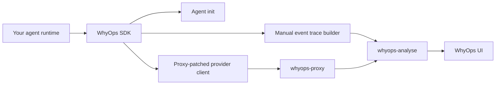

WhyOps ships three first-party SDK packages so you can instrument agents without stitching the proxy and events API together manually.

<CardGroup cols={3}>
  <Card title="TypeScript / JavaScript" icon="code" href="/integrations/typescript-sdk">
    `@whyops/sdk` patches OpenAI and Anthropic clients, auto-initializes agents, and emits manual trace events.
  </Card>
  <Card title="Python" icon="terminal" href="/integrations/python-sdk">
    `whyops` supports both sync and async flows, plus direct helpers for OpenAI and Anthropic clients.
  </Card>
  <Card title="Go" icon="diagram-project" href="/integrations/go-sdk">
    The Go module provides a trace builder, agent init, and a proxy-aware `http.Client` transport.
  </Card>
</CardGroup>

## Install

<Tabs>
  <Tab title="npm">
    ```bash
    npm install @whyops/sdk
    ```
  </Tab>
  <Tab title="PyPI">
    ```bash
    pip install whyops
    ```
  </Tab>
  <Tab title="Go Modules">
    ```bash
    go get github.com/whyops-org/whyops-op/packages/sdk-go@latest
    ```
  </Tab>
</Tabs>

## What every package covers

| Capability | TypeScript | Python | Go |
|---|---:|---:|---:|
| Hosted defaults for proxy + analyse URLs | Yes | Yes | Yes |
| Automatic agent init before first event | Yes | Yes | Yes |
| OpenAI proxy helper | Yes | Yes | Via `ProxyHTTPClient()` |
| Anthropic proxy helper | Yes | Yes | Via `ProxyHTTPClient()` |
| Manual runtime events | Yes | Yes | Yes |
| Prompt caching-aware token fields | Yes | Yes | Yes |
| Self-hosted URL overrides | Yes | Yes | Yes |

## Pick an integration pattern

<Steps>
  <Step title="Proxy mode">
    Route OpenAI or Anthropic traffic through `https://proxy.whyops.com` so prompt, completion, tool call, and embedding telemetry are captured automatically.
  </Step>
  <Step title="Manual events mode">
    Use the trace builder when you want tool execution, retries, errors, orchestration milestones, and custom runtime state visible in the graph.
  </Step>
  <Step title="Hybrid mode">
    Proxy the LLM calls and add manual events for everything the proxy cannot see, such as tool latency, framework retries, and app-side failures.
  </Step>
</Steps>



## Hosted defaults

All three packages use these defaults when you do not override them:

| Setting | Default |
|---|---|
| Proxy base URL | `https://proxy.whyops.com` |
| Analyse base URL | `https://a.whyops.com/api` |
| Agent init fallback path | `/v1/agents/init` |
| Manual events ingest path | `/events/ingest` |

<Callout type="info" title="Prompt caching fields">
  The SDK event payloads already support `cacheReadTokens` and `cacheCreationTokens` inside usage metadata, so you can report cache-aware token usage when you emit manual `llm_response` events.
</Callout>

## Common mistakes to avoid

- Do not send your provider API key to the SDK helpers. After patching, the client authenticates to WhyOps with `WHYOPS_API_KEY`, while the upstream provider key stays stored in WhyOps.
- Keep `agentName` stable across proxy traffic and manual events, or traces will fragment across multiple agent identities.
- For Go, remember that `ProxyHTTPClient()` injects headers only. Your provider client must still point at the WhyOps proxy host.
- If you self-host, override `proxyBaseUrl` and `analyseBaseUrl` in the SDK config instead of rewriting URLs in every request.

## Next pages

<CardGroup cols={3}>
  <Card title="TypeScript Guide" icon="code" href="/integrations/typescript-sdk">
    Full `@whyops/sdk` setup, OpenAI and Anthropic patching, manual event patterns, and self-hosted config.
  </Card>
  <Card title="Python Guide" icon="terminal" href="/integrations/python-sdk">
    Sync and async examples, proxy helpers, trace methods, and usage metadata fields.
  </Card>
  <Card title="Go Guide" icon="diagram-project" href="/integrations/go-sdk">
    Manual event builder, proxy transport usage, and a Go-specific runtime checklist.
  </Card>
</CardGroup>
