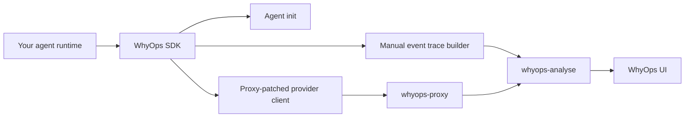

WhyOps ships three first-party SDK packages so you can instrument agents without stitching the proxy and events API together manually.

<CardGroup cols={3}>
  <Card title="TypeScript / JavaScript" icon="code" href="/integrations/typescript-sdk">
    Start with the TypeScript quickstart, then move to proxy helpers, runtime events, and advanced patterns.
  </Card>
  <Card title="Python" icon="terminal" href="/integrations/python-sdk">
    Start with the Python quickstart, then move to proxy helpers, runtime events, and advanced sync or async patterns.
  </Card>
  <Card title="Go" icon="diagram-project" href="/integrations/go-sdk">
    Start with the Go quickstart, then move to proxy transport and runtime events.
  </Card>
</CardGroup>

## The recommended order

<Steps>
  <Step title="1. Choose your language package">
    Pick the TypeScript, Python, or Go section in the sidebar based on the service you are instrumenting.
  </Step>
  <Step title="2. Create a WhyOps client with stable agent metadata">
    Define `agentName`, `systemPrompt`, and tool metadata once so WhyOps can version the agent correctly.
  </Step>
  <Step title="3. Initialize the agent early">
    Call `initAgent()`, `init_agent_sync()` or `InitAgent(ctx)` during boot so registration errors surface before runtime traffic.
  </Step>
  <Step title="4. Route model calls through the proxy">
    Use the package proxy helper or transport so your OpenAI or Anthropic traffic goes through WhyOps.
  </Step>
  <Step title="5. Add runtime events where the proxy cannot see enough">
    Use trace events for tool execution, retries, failures, prompt caching-aware usage, and framework orchestration.
  </Step>
</Steps>

## Package map

| Capability | TypeScript | Python | Go |
|---|---:|---:|---:|
| Hosted defaults for proxy + analyse URLs | Yes | Yes | Yes |
| Automatic agent init before first event | Yes | Yes | Yes |
| OpenAI proxy helper | Yes | Yes | Via `ProxyHTTPClient()` |
| Anthropic proxy helper | Yes | Yes | Via `ProxyHTTPClient()` |
| Manual runtime events | Yes | Yes | Yes |
| Prompt caching-aware token fields | Yes | Yes | Yes |
| Self-hosted URL overrides | Yes | Yes | Yes |

## Install

<Tabs>
  <Tab title="npm">
    ```bash
    npm install @whyops/sdk
    ```
  </Tab>
  <Tab title="PyPI">
    ```bash
    pip install whyops
    ```
  </Tab>
  <Tab title="Go Modules">
    ```bash
    go get github.com/whyops-org/whyops-op/packages/sdk-go@latest
    ```
  </Tab>
</Tabs>



## Hosted defaults used by the SDKs

All three packages use these defaults when you do not override them:

| Setting | Default |
|---|---|
| Proxy base URL | `https://proxy.whyops.com` |
| Analyse base URL | `https://a.whyops.com/api` |
| Agent init fallback path | `/v1/agents/init` |
| Manual events ingest path | `/events/ingest` |

<Callout type="info" title="Prompt caching fields">
  The SDK event payloads already support `cacheReadTokens` and `cacheCreationTokens` inside usage metadata, so you can report cache-aware token usage when you emit manual `llm_response` events.
</Callout>

## Choose your section in the sidebar

<CardGroup cols={3}>
  <Card title="TypeScript SDK" icon="code" href="/integrations/typescript-sdk">
    Best for Node.js, Bun, and modern server-side TypeScript services using OpenAI or Anthropic SDKs.
  </Card>
  <Card title="Python SDK" icon="terminal" href="/integrations/python-sdk">
    Best for synchronous APIs, async workers, and Python services that need one package for proxying and runtime traces.
  </Card>
  <Card title="Go SDK" icon="diagram-project" href="/integrations/go-sdk">
    Best for backend services that want a trace builder plus a proxy-aware `http.Client` transport.
  </Card>
</CardGroup>
