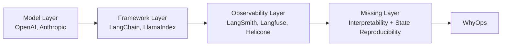

# WhyOps

WhyOps is the Agent Runtime Observability platform. It does not just show what happened in an agent system. It reconstructs why the system made a decision by capturing the decision environment itself.

<Callout type="info">
WhyOps is currently a concept and architecture. There is no SDK or proxy available yet. This documentation captures the design and strategy.
</Callout>

<CardGroup cols={3}>
  <Card title="Decision Infrastructure" icon="brain" href="/core-model">
    Instrument decision boundaries to expose cognition, not just API calls.
  </Card>
  <Card title="State Reproducibility" icon="repeat" href="/architecture/state-replay">
    Recreate the exact decision context to debug production failures.
  </Card>
  <Card title="Agent Runtime Observability" icon="timeline" href="/positioning">
    A new layer beyond logs and traces: cognition-level telemetry.
  </Card>
</CardGroup>

## The gap in today’s stack

Traditional observability works for deterministic software. Agents are not deterministic. They iterate, use tools, mutate memory, and are guided by planners. Existing tools show LLM calls, not agent cognition.

## The promise

- **Observability shows what happened. WhyOps shows why.**
- Captures the difference between **LLM cognition** and **runtime cognition**.
- Builds a **decision graph** and a **replayable state**.

<AccordionGroup>
  <Accordion title="What WhyOps is not">
    <ul>
      <li>Another logging dashboard</li>
      <li>A prompt debugger</li>
      <li>A generic APM tool</li>
    </ul>
  </Accordion>
  <Accordion title="What WhyOps is">
    <ul>
      <li>Decision context reconstruction</li>
      <li>Agent runtime observability</li>
      <li>Reproducible state for debugging</li>
    </ul>
  </Accordion>
</AccordionGroup>

## How to read these docs

- Start with **Problem Space** and **Core System Model**.
- Follow with **Architecture** and **Event Schema**.
- Use **Implementation Plan** and **Strategy** to guide execution.
