**Observability for AI agents — without touching your critical path.**

WhyOps reveals why your AI agents make decisions, not just what they did. Using shadow telemetry architecture, we observe your agent traffic in parallel—never inline. If WhyOps goes down, your AI keeps running.

<Callout type="success" title="Zero Production Risk">
**WhyOps runs alongside your AI, never in front of it.**

Your LLM requests go directly to providers (OpenAI, Anthropic, etc.). WhyOps receives a parallel copy for observability. Zero added latency. Zero single point of failure.
</Callout>

<Callout type="warning" title="Development Status">
WhyOps is currently in conceptual/design phase. No SDK or proxy is available yet. This documentation captures the complete architecture, event schemas, and implementation roadmap for building the platform.
</Callout>

---

## The Core Problem

Traditional observability was built for deterministic software. AI agents are fundamentally different:

<CardGroup cols={2}>
  <Card title="Traditional Software" icon="code">
    - Deterministic execution
    - Request → Response
    - Errors are reproducible
    - Stack traces explain failures
  </Card>
  <Card title="AI Agent Systems" icon="robot">
    - Non-deterministic decisions
    - Iterative planning loops
    - Memory-influenced behavior
    - Hidden retry logic
  </Card>
</CardGroup>

### When Agents Fail, You Ask:
- Why did it choose **that specific tool**?
- Why did it **retry 4 times** instead of stopping?
- Why did it **ignore the correct document** from retrieval?
- Why did it **terminate early** without finishing?
- Why did it **hallucinate** despite having accurate data?

**Current observability tools cannot answer these questions.**

---

## The WhyOps Solution

WhyOps creates a new infrastructure layer: **Decision Infrastructure**.

### What Makes WhyOps Different

<Tabs>
  <Tab title="Current Tools">
    **What They Capture:**
    - LLM API requests/responses
    - Prompt text and completions
    - Token usage and latency
    - Basic execution traces
    
    **What They Miss:**
    - ❌ Tool execution reality (retries, errors)
    - ❌ Memory retrieval decisions
    - ❌ Planner internal state
    - ❌ Framework overrides
    - ❌ Silent failures
  </Tab>
  
  <Tab title="WhyOps">
    **Full Cognitive Visibility:**
    - ✅ Complete LLM interaction
    - ✅ Actual tool execution (not just requests)
    - ✅ Memory influence tracking
    - ✅ Planner state and strategy changes
    - ✅ Retry logic and failure patterns
    - ✅ Framework behavior
    - ✅ **State Replay** for debugging
    
    **Result:** Understand *why* decisions were made
  </Tab>
</Tabs>

---

## Production-Safe by Design

<Callout type="success" title="The Trust Question: Can We Rely on WhyOps in Production?">
**Absolutely. WhyOps is designed to never break your AI—even if our service goes down.**

We use **shadow telemetry architecture**: your LLM requests go directly to providers (OpenAI, Anthropic, etc.), while WhyOps observes a parallel copy.
</Callout>

### How Shadow Telemetry Works

```mermaid
flowchart TB
    A[Your Application]
    
    subgraph "Parallel Routing - Zero Production Risk"
    B[Route 1: Direct to LLM<br/>✅ Your Production Traffic]
    C[Route 2: WhyOps Observer<br/>📊 Telemetry Copy]
    end
    
    D[OpenAI/Anthropic<br/>Direct Connection]
    E[WhyOps Telemetry Plane<br/>Async Processing]
    
    F[Response to User<br/>✅ No WhyOps Dependency]
    G[Decision Graph Built<br/>📊 Observability Ready]
    
    A -->|Same Request| B
    A -->|Copy| C
    
    B --> D
    C --> E
    
    D --> F
    E --> G
    
    style B fill:#10b981,stroke:#333
    style F fill:#10b981,stroke:#333
    style C fill:#3b82f6,stroke:#333
    style G fill:#3b82f6,stroke:#333
```

**Key Benefits:**

<CardGroup cols={3}>
  <Card title="Zero Added Latency" icon="gauge">
    Your users see the same performance as calling OpenAI directly. WhyOps mirrors traffic asynchronously.
  </Card>
  
  <Card title="Zero Production Risk" icon="shield">
    If WhyOps goes down, your AI keeps running. You temporarily lose observability dashboards, never functionality.
  </Card>
  
  <Card title="Zero Trust Barriers" icon="check">
    No vendor lock-in. No single point of failure. Enterprises can adopt without security concerns.
  </Card>
</CardGroup>

**What Happens If WhyOps is Down:**
- ✅ Your LLM requests continue working (direct to OpenAI)
- ✅ User experience unchanged
- ❌ New decision graphs not built (temporary)
- ❌ Observability dashboards unavailable (temporary)

**This is called "fail-open" design** — the same model used by Datadog, New Relic, and Sentry.

<Callout type="info">
**Not a proxy, a shadow telemetry plane.**

Unlike traditional proxies that sit in your request path, WhyOps observes in parallel. We're out-of-band observability, not an inline gateway.

[Learn more about Shadow Telemetry Architecture →](/architecture/shadow-telemetry)
</Callout>

---

## Core Capabilities

<CardGroup cols={3}>
  <Card title="Decision Boundaries" icon="brain" href="/core-model">
    Capture the four cognitive boundaries where agents make decisions: Planning, Memory, Reasoning, and Tool Execution
  </Card>
  
  <Card title="State Replay" icon="clock-rotate-left" href="/architecture/state-replay">
    Reproduce production agent failures in development by recreating the exact decision environment
  </Card>
  
  <Card title="Decision Graphs" icon="diagram-project" href="/architecture/decision-graph">
    Visualize the complete decision flow as a directed acyclic graph showing causality
  </Card>
  
  <Card title="Two Integration Modes" icon="plug" href="/architecture/integration-modes">
    Proxy mode for zero-friction adoption, SDK mode for complete visibility
  </Card>
  
  <Card title="Framework Agnostic" icon="cubes">
    Works with any agent framework by instrumenting universal decision boundaries
  </Card>
  
  <Card title="Event-Driven Architecture" icon="timeline" href="/events/overview">
    Five canonical event types capture all agent cognition moments
  </Card>
</CardGroup>

---

## The Category We're Creating

WhyOps defines **Agent Runtime Observability (ARO)**—a new category beyond traditional observability.

| Evolution Stage | Focus | Tools |
|----------------|-------|-------|
| Server Logs | What happened on servers | Syslog, log files |
| APM | Application performance | New Relic, AppDynamics |
| Distributed Tracing | Service-to-service flow | Jaeger, Zipkin |
| LLM Observability | Model API calls | LangSmith, Langfuse |
| **Agent Runtime Observability** | **Agent cognition &amp; decisions** | **WhyOps** |

<Callout type="tip" title="The Insight">
The problem isn't that "agents are unreliable"—it's that **agents are un-debuggable because their decision state is invisible**.

WhyOps makes decision state visible and reproducible.
</Callout>

---

## Quick Start Guide

<Steps>
  <Step title="Understand the Problem">
    Read [Problem Space](/problem-space) to see why traditional observability fails for agents
  </Step>
  
  <Step title="Learn the Model">
    Study the [Core System Model](/core-model) to understand the four cognitive boundaries
  </Step>
  
  <Step title="Explore Architecture">
    Review [Architecture Overview](/architecture/overview) to see how WhyOps works
  </Step>
  
  <Step title="See Integration Options">
    Compare [Proxy vs SDK modes](/architecture/integration-modes) for your use case
  </Step>
  
  <Step title="Review Implementation">
    Check the [MVP Scope](/implementation/mvp) and [Roadmap](/strategy/roadmap)
  </Step>
</Steps>

---

## Who Should Use WhyOps

<AccordionGroup>
  <Accordion title="AI Startups Building Production Agents" icon="rocket">
    **Pain:** Agents work in demos, fail unpredictably in production
    
    **WhyOps Value:**
    - Debug production failures in minutes, not days
    - Understand why tool calls fail
    - Track memory influence on decisions
    - Replay production state in development
  </Accordion>
  
  <Accordion title="Enterprise AI Teams" icon="building">
    **Pain:** Cannot explain agent decisions to stakeholders or compliance
    
    **WhyOps Value:**
    - Complete audit trail of agent decisions
    - Explainability for regulatory requirements
    - Governance and policy enforcement
    - Team collaboration on agent debugging
  </Accordion>
  
  <Accordion title="Agent Framework Developers" icon="code">
    **Pain:** Users complain about agent reliability but can't debug
    
    **WhyOps Value:**
    - Built-in observability for your framework
    - Differentiate from competitors
    - Reduce support burden
    - Improve user retention
  </Accordion>
  
  <Accordion title="AI Research Labs" icon="flask">
    **Pain:** Difficult to analyze agent behavior patterns at scale
    
    **WhyOps Value:**
    - Rich datasets for behavior analysis
    - Pattern detection across agent runs
    - Research insights from decision graphs
    - Reproducible experiments
  </Accordion>
</AccordionGroup>

---

## Documentation Structure

This documentation is organized into six main sections:

| Section | Purpose | Start Here |
|---------|---------|-----------|
| **Get Started** | Understand the problem and core concepts | [Problem Space](/problem-space) |
| **Architecture** | Learn how WhyOps works technically | [Overview](/architecture/overview) |
| **Event Schema** | Dive into the event data model | [Events Overview](/events/overview) |
| **Use Cases** | See real-world debugging scenarios | [Silent Retries](/use-cases/silent-retries) |
| **Implementation** | Build and deploy WhyOps | [MVP Scope](/implementation/mvp) |
| **Strategy** | Business positioning and roadmap | [Category Definition](/strategy/category-definition) |

---

## Next Steps

<CardGroup cols={2}>
  <Card title="Understand the Problem" icon="magnifying-glass" href="/problem-space">
    Why traditional observability fails for autonomous agents
  </Card>
  
  <Card title="Core System Model" icon="diagram-project" href="/core-model">
    The four decision boundaries and two layers of reality
  </Card>
  
  <Card title="See It In Action" icon="play" href="/use-cases/silent-retries">
    Real debugging scenarios WhyOps solves
  </Card>
  
  <Card title="Implementation Plan" icon="list-check" href="/implementation/mvp">
    How we're building this platform
  </Card>
</CardGroup>
