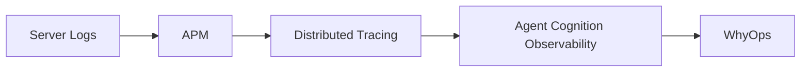

# Category Positioning

WhyOps defines **Agent Runtime Observability (ARO)**.

<CardGroup cols={3}>
  <Card title="Not logs" icon="file-lines">Not a log viewer or trace console.</Card>
  <Card title="Not prompt-only" icon="comment-dots">Not just LLM request capture.</Card>
  <Card title="Not APM" icon="chart-simple">Not service-level telemetry.</Card>
</CardGroup>

## Positioning statement

**Observability shows what happened. WhyOps shows why.**

## Competitive differentiation

| Category | Focus | WhyOps difference |
| --- | --- | --- |
| LLM observability | API calls | Decision context and runtime cognition |
| Prompt debugging | Prompt quality | Agent decision reconstruction |
| APM | Service performance | Agent behavior explanation |

<Callout type="tip">
The insight is not “agents are unreliable” but “agents are un-debuggable because decision state is invisible.”
</Callout>
