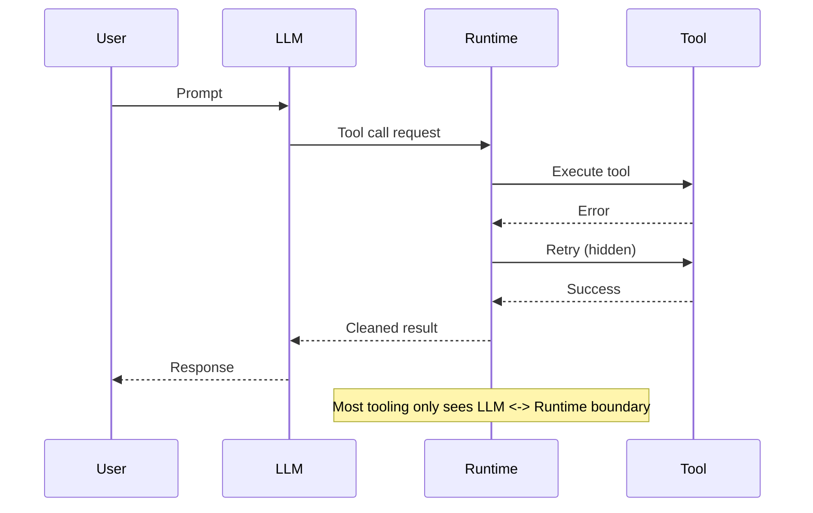

# The Problem Space

Agent failures feel random because the decision state is invisible.

## What developers want to know

- Why did the agent choose this tool?
- Why did it retry four times?
- Why did it ignore the correct document?
- Why did it stop early?
- Why did it hallucinate with correct data available?

## Why traditional observability fails

- It was built for deterministic software.
- It treats the system as a request/response loop.
- It does not see memory retrievals, planner state, or internal retries.

<Callout type="info">
WhyOps focuses on the decision boundaries where cognition happens, not just the LLM API call.
</Callout>

## The real root cause

LLM cognition is visible in the prompt. Runtime cognition is not.

- **LLM cognition**: prompt, tools, response.
- **Runtime cognition**: retries, memory changes, planner state, termination rules.

The missing layer is **interpretability + state reproducibility**.
