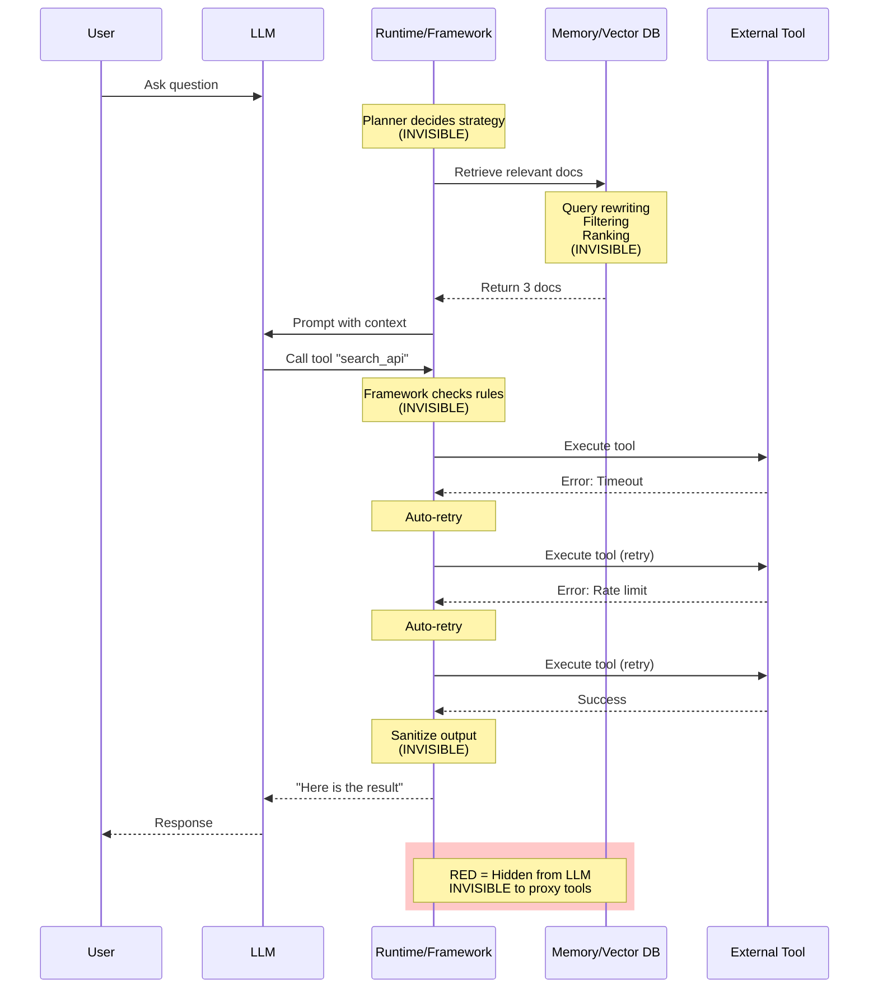

Agent systems feel unpredictable and buggy—not because the underlying models are unreliable, but because **their decision-making process is invisible**.

<Callout type="warning" title="The Core Issue">
Traditional observability was designed for **deterministic request/response systems**. Agents are **non-deterministic autonomous systems** that plan, remember, iterate, and use tools. The existing mental model doesn't transfer.
</Callout>

---

## The Questions You Can't Answer Today

When production agents fail, you need to know **why decisions were made**:

<AccordionGroup>
  <Accordion title="Why did the agent choose THAT specific tool?" icon="wrench">
    **Scenario:**
    - Agent has 12 tools available
    - Picks `search_web` instead of `query_database`
    - Database had the right answer
    - Web search returns irrelevant results
    
    **What You See (Current Tools):**
    ```json
    {
      "tools_available": ["search_web", "query_database", ...],
      "tool_selected": "search_web",
      "result": "irrelevant web results"
    }
    ```
    
    **What You Need to Know:**
    - What was the planner's reasoning?
    - What memory influenced the choice?
    - Was there a tool override rule?
    - What was in the system prompt about tool selection?
    
    **WhyOps Shows:**
    ```json
    {
      "planner_state": {
        "last_tool_used": "query_database",
        "consecutive_db_failures": 3,
        "strategy": "try_alternative_source"
      },
      "decision_reasoning": "Switched from database to web after 3 consecutive DB failures",
      "memory_influence": ["previous_db_timeout_at_step_2"],
      "tool_selection_prompt": "If database fails repeatedly, try web search"
    }
    ```
    
    **Root Cause Revealed:** Database connection was flaky; agent *correctly* switched strategies after retries
  </Accordion>

  <Accordion title="Why did it retry 4 times instead of stopping?" icon="rotate">
    **Scenario:**
    - Tool call fails
    - Agent retries 4 times (each taking 5 seconds)
    - Total: 20 seconds wasted
    - Eventually succeeds but user experience is terrible
    
    **What You See (Current Tools):**
    ```
    11:30:15 - LLM: Call search_api("AI news")
    11:30:35 - Tool Result: Success
    [20 second gap, no explanation]
    ```
    
    **What You Need to Know:**
    - How many retries occurred?
    - What were the failure reasons?
    - Who decided to retry (LLM or framework)?
    - What's the retry policy?
    
    **WhyOps Shows:**
    ```json
    {
      "tool_execution": {
        "attempts": [
          {"attempt": 1, "error": "rate_limit", "duration_ms": 5000},
          {"attempt": 2, "error": "timeout", "duration_ms": 5000},
          {"attempt": 3, "error": "timeout", "duration_ms": 5000},
          {"attempt": 4, "success": true, "duration_ms": 5000}
        ],
        "retry_policy": "exponential_backoff",
        "retry_source": "framework_automatic",
        "llm_aware_of_retries": false
      }
    }
    ```
    
    **Root Cause Revealed:** Framework-level automatic retries; LLM never knew about failures
  </Accordion>

  <Accordion title="Why did it ignore the correct document?" icon="file-slash">
    **Scenario:**
    - User asks about "latest refund policy"
    - Vector DB has the correct policy document (updated last week)
    - Agent retrieves outdated documents from 6 months ago
    - Provides incorrect information
    
    **What You See (Current Tools):**
    ```
    Prompt: "Based on this context: [6-month-old policy docs], answer..."
    ```
    
    **What You Need to Know:**
    - What query was sent to the vector DB?
    - How many candidates were found?
    - What were their similarity scores?
    - Why wasn't the latest doc retrieved?
    - What filters were applied?
    
    **WhyOps Shows:**
    ```json
    {
      "memory_retrieval": {
        "user_query": "latest refund policy",
        "rewritten_query": "refund policy",  ← Lost "latest"!
        "total_candidates": 47,
        "similarity_scores": [0.94, 0.91, 0.89, 0.87, ...],
        "threshold": 0.90,  ← Too high
        "passed_threshold": 2,  ← Only 2 docs
        "latest_doc_score": 0.87,  ← Filtered out!
        "used_docs": [
          {"id": "doc_old_1", "age_days": 180, "score": 0.94},
          {"id": "doc_old_2", "age_days": 175, "score": 0.91}
        ],
        "rejected_docs": [
          {"id": "doc_latest", "age_days": 7, "score": 0.87, "reason": "below_threshold"}
        ]
      }
    }
    ```
    
    **Root Causes Revealed:**
    1. Query rewriter removed "latest" keyword
    2. Similarity threshold (0.90) filtered out newest doc (0.87)
    3. No recency bias in ranking
  </Accordion>

  <Accordion title="Why did it stop early without finishing the task?" icon="stop">
    **Scenario:**
    - User asks complex multi-step question
    - Agent starts working on it
    - After 5 steps, agent stops
    - Task is incomplete but agent says nothing
    
    **What You See (Current Tools):**
    ```
    Step 5: LLM says "Let me search for more information..."
    [Execution ends]
    ```
    
    **What You Need to Know:**
    - Did LLM decide to stop?
    - Did framework kill it?
    - Was there an error?
    - What were the termination conditions?
    
    **WhyOps Shows:**
    ```json
    {
      "agent_termination": {
        "reason": "max_iterations_reached",
        "configured_max": 5,
        "steps_taken": 5,
        "llm_wanted_to_continue": true,
        "last_llm_action": "tool_call_request",
        "task_completion_estimate": "40%",
        "termination_source": "framework_enforced"
      }
    }
    ```
    
    **Root Cause Revealed:** Configuration issue (`max_iterations=5` too low), not LLM failure
  </Accordion>

  <Accordion title="Why did it hallucinate with correct data available?" icon="sparkles">
    **Scenario:**
    - Question: "What's our company's vacation policy?"
    - Knowledge base has the exact policy document
    - Agent makes up a plausible but incorrect answer
    - Classic hallucination
    
    **What You See (Current Tools):**
    ```
    Prompt: "Answer based on context: [empty]
    User question: What's our vacation policy?"
    
    Response: "Based on standard practices, employees typically get 10 days..."
    ```
    
    **What You Need to Know:**
    - Why was context empty?
    - Did retrieval happen?
    - Were documents found but filtered out?
    - What went wrong in the RAG pipeline?
    
    **WhyOps Shows:**
    ```json
    {
      "memory_retrieval": {
        "query": "vacation policy",
        "query_embedding_generated": true,
        "vector_search_results": 8,
        "similarity_scores": [0.76, 0.73, 0.71, 0.69, ...],
        "threshold_configured": 0.80,  ← Problem!
        "documents_passed_threshold": 0,  ← Nothing!
        "context_injected": "empty",
        "llm_forced_to_guess": true
      }
    }
    ```
    
    **Root Cause Revealed:** Similarity threshold (0.80) was too strict; filtered out all relevant docs (best: 0.76)
  </Accordion>
</AccordionGroup>

---

## Why Traditional Observability Fails

### Traditional Software vs Autonomous Agents

<Tabs>
  <Tab title="Traditional Software">
    **Characteristics:**
    - ✅ Deterministic execution paths
    - ✅ Request → Process → Response
    - ✅ Errors have stack traces
    - ✅ Reproducible failures
    - ✅ Visible control flow
    
    **Observability Tools Work:**
    - Logs show exact code path
    - Traces show service calls
    - Metrics show performance
    - Errors point to line numbers
    
    **Mental Model:** Linear execution with known branches
  </Tab>
  
  <Tab title="Agent Systems">
    **Characteristics:**
    - ❌ Non-deterministic decisions
    - ❌ Iterative planning loops
    - ❌ Memory-influenced behavior
    - ❌ Hidden retry logic
    - ❌ Runtime state mutations
    
    **Traditional Tools Break:**
    - Logs miss 40% of decisions
    - Traces don't show cognitive flow
    - Metrics can't measure "decision quality"
    - Errors don't explain "why"
    
    **Mental Model:** Autonomous cognitive system with hidden state
  </Tab>
</Tabs>

### The Visibility Gap



**What Proxy Tools Capture:** LLM ↔ Runtime boundary (blue arrows only)  
**What They Miss:** Everything in red boxes (~40% of agent behavior)

---

## The Two Layers of Reality

<CardGroup cols={2}>
  <Card title="LLM Cognition" icon="message">
    **Visible in prompts and responses**
    
    **Includes:**
    - System prompts
    - User messages
    - Tool definitions available
    - Model-generated responses
    - Reasoning chains
    
    **Capturable via:** Proxy tools (LangSmith, Langfuse, Helicone)
    
    **Coverage:** ~60-70% of decisions
  </Card>
  
  <Card title="Runtime Cognition" icon="gear">
    **Hidden in framework logic**
    
    **Includes:**
    - Silent tool retries
    - Memory retrieval strategies
    - Planner state changes
    - Tool routing overrides
    - Termination conditions
    - Output sanitization
    
    **Requires:** SDK instrumentation
    
    **Coverage:** The missing 30-40%
  </Card>
</CardGroup>

<Callout type="info" title="The Fundamental Insight">
**LLM APIs are stateless. Agent runtimes are stateful.**

If you only observe the stateless boundary (LLM API), you miss the stateful runtime decisions that cause most failures.
</Callout>

---

## The Debugging Time Sink

### Current State: Debugging Without Cognitive Visibility

<Steps>
  <Step title="Agent Fails in Production">
    User reports issue: "Agent gave wrong answer" or "Agent is slow"
  </Step>
  
  <Step title="Check Logs (90 minutes)">
    - Read LLM request/response logs
    - See *what* happened, not *why*
    - Can't reproduce locally
  </Step>
  
  <Step title="Guess and Test (2-4 hours)">
    - Hypothesis: "Maybe the prompt is bad"
    - Try different prompts
    - Still can't reproduce exact failure
  </Step>
  
  <Step title="Add More Logging (1 hour)">
    - Modify code to log more details
    - Redeploy to production
    - Wait for failure to occur again
  </Step>
  
  <Step title="Collect New Logs (2+ hours)">
    - Wait for issue to happen again
    - Collect new logs
    - Discover new clues
  </Step>
  
  <Step title="Identify Root Cause (1 hour)">
    - Finally understand the issue
    - Was a configuration problem all along
  </Step>
  
  <Step title="Fix and Validate (1 hour)">
    - Apply fix
    - Test
    - Redeploy
  </Step>
</Steps>

**Total Time:** 6-10 hours (or days if rare failure)

**Success Rate:** ~60% (40% never fully debugged)

### With WhyOps: Debugging With State Replay

<Steps>
  <Step title="Agent Fails in Production">
    WhyOps alert: "Thread t_47293 failed at step 5"
  </Step>
  
  <Step title="Load State Replay (2 minutes)">
    Click "Replay in Dev" → Download snapshot
  </Step>
  
  <Step title="Inspect Decision Graph (5 minutes)">
    See exact sequence: Memory retrieval → LLM call → Tool execution failure
  </Step>
  
  <Step title="Identify Root Cause (3 minutes)">
    Tool config had `threshold: 0.90`, should be `0.70`
  </Step>
  
  <Step title="Test Fix Locally (5 minutes)">
    Modify config, replay thread, verify success
  </Step>
  
  <Step title="Deploy Fix (10 minutes)">
    Push config change to production
  </Step>
</Steps>

**Total Time:** 25 minutes

**Success Rate:** ~95%

**Time Savings:** 10-20x faster

---

## The Missing Layer

### Evolution of Observability

| Era | Focus | Tools | Agent Support |
|-----|-------|-------|---------------|
| **Server Logs (2000s)** | "What happened on this machine?" | syslog, log files | ❌ |
| **APM (2010s)** | "How is my app performing?" | New Relic, Datadog | ❌ |
| **Distributed Tracing (2015+)** | "How do services interact?" | Jaeger, Zipkin | ❌ |
| **LLM Observability (2023+)** | "What LLM calls were made?" | LangSmith, Langfuse | ⚠️ Partial |
| **Agent Runtime Observability (2025+)** | **"Why did the agent decide this?"** | **WhyOps** | ✅ **Full** |

<Callout type="tip" title="WhyOps Defines the Next Layer">
Just as distributed tracing was essential for microservices, **Agent Runtime Observability** is essential for production AI agents.

The layer that's currently missing.
</Callout>

---

## Real-World Impact

### Case Study: Customer Support Agent Failures

**Company:** SaaS startup with AI customer support agent  
**Issue:** 15% of queries result in incorrect refund amounts  
**Business Impact:** $50K/month in incorrect refunds + customer complaints

**Investigation with Traditional Tools (1 week):**
- ✅ Found LLM was calling `calculate_refund` tool
- ✅ Saw tool returned correct amounts
- ❌ Couldn't understand why final answer was wrong
- ❌ Couldn't reproduce in dev environment
- Result: Added manual review step (slowed operations)

**Investigation with WhyOps (30 minutes):**

```json
{
  "decision_graph": [
    {
      "step": 3,
      "event": "tool_execution",
      "tool": "calculate_refund",
      "result": "$47.32",  ← Correct
      "sanitized_result": "$47"  ← Framework rounded! 
    },
    {
      "step": 4,
      "event": "llm_call",
      "context": "The refund amount is $47",  ← LLM sees rounded version
      "response": "I'll process a $47 refund"  ← Wrong by $0.32
    }
  ]
}
```

**Root Cause:** Framework configuration had `round_currency: true` for tool outputs  
**Fix:** Changed config to `round_currency: false`  
**Time Saved:** 6.5 days  
**Money Saved:** Prevented ongoing $50K/month loss

---

## The Core Realization

<Callout type="success" title="The Problem Isn't the Models">
**Most people say:** "Agents are unreliable because LLMs are non-deterministic"

**WhyOps reframes it:** "Agents are un-debuggable because decision state is invisible"

This isn't a model problem. It's an **observability gap**.
</Callout>

---

## What's Needed: The Three Requirements

<CardGroup cols={3}>
  <Card title="1. Cognitive Visibility" icon="eye">
    Capture decisions at all four boundaries:
    - Planner strategy
    - Memory influence
    - LLM reasoning
    - Tool execution
  </Card>
  
  <Card title="2. State Reproducibility" icon="clone">
    Recreate exact production environment:
    - Same prompts
    - Same memory state
    - Same tools available
    - Same configuration
  </Card>
  
  <Card title="3. Causal Understanding" icon="diagram-project">
    Show why decisions happened:
    - What memory influenced this?
    - Why was this tool chosen?
    - What caused the retry?
    - Why did it terminate?
  </Card>
</CardGroup>

**This is what WhyOps provides.**

---

## Next: How WhyOps Solves This

<Steps>
  <Step title="Understand the Core Model">
    Learn the four decision boundaries WhyOps instruments
    
    [Read Core System Model →](/core-model)
  </Step>
  
  <Step title="See the Hidden Layers">
    Discover the six types of cognition proxy tools miss
    
    [Read Hidden Cognitive Layers →](/concepts/hidden-cognition)
  </Step>
  
  <Step title="Explore State Replay">
    The killer feature that makes debugging reproducible
    
    [Read State Replay Feature →](/features/state-replay)
  </Step>
</Steps>

<CardGroup cols={2}>
  <Card title="Architecture Overview" icon="sitemap" href="/architecture/overview">
    How WhyOps captures complete agent cognition
  </Card>
  
  <Card title="Use Cases" icon="book" href="/use-cases/silent-retries">
    Real debugging scenarios WhyOps solves
  </Card>
</CardGroup>
