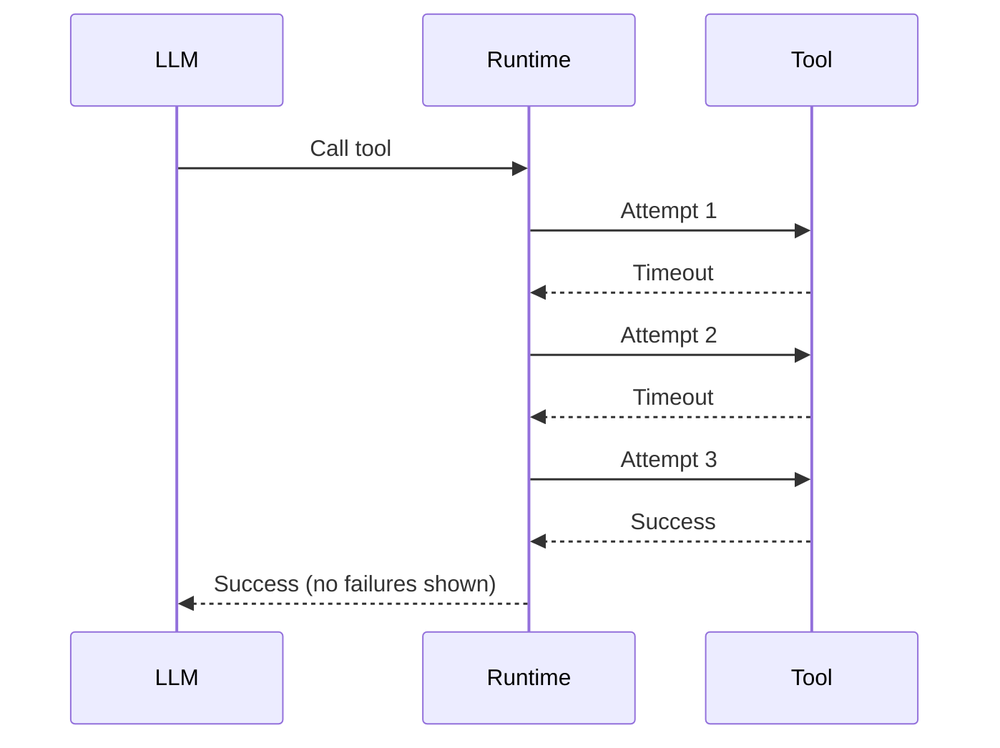

# Silent Tool Retries

## Scenario

- LLM requests a tool.
- The tool fails.
- The framework retries internally.
- Only the final success is sent to the LLM.

## Why it is hard to debug

- Proxy sees one tool call and one success.
- Latency spikes have no obvious cause.

## WhyOps value

- Tool execution event captures every retry.
- Planner step shows whether the retry was strategic or automatic.
